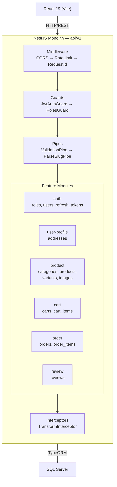
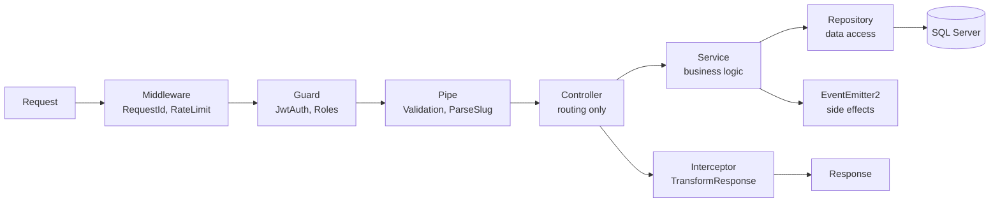
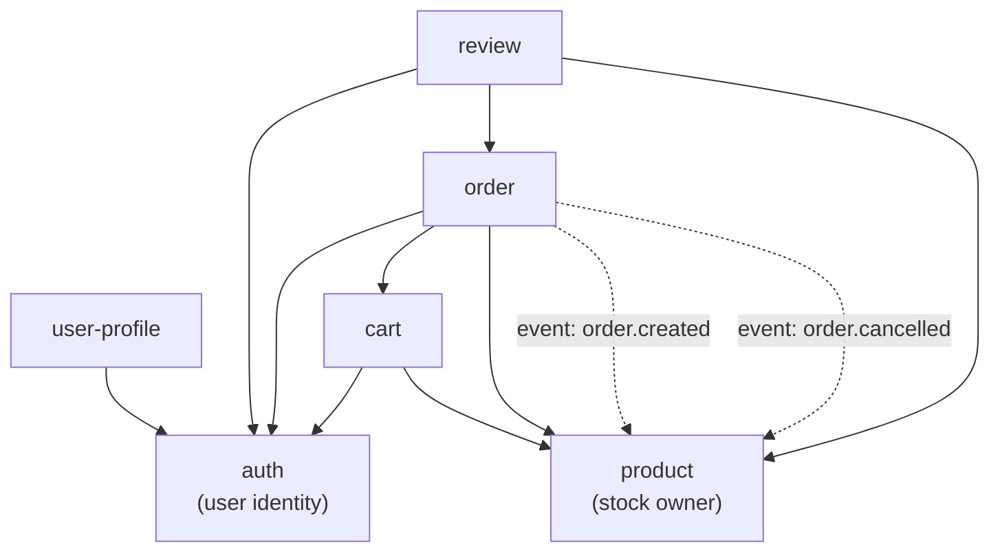

# ARCHITECTURE.md — Backend (NestJS)

## 1. System Overview



**Why monolith?** Single deployable, features map 1:1 to business domains. Each feature owns its entities, logic, and routes — structured for future extraction into microservices if needed.

---

## 2. Folder Structure

```
src/
├── main.ts                              — bootstrap, global pipes/filters/interceptors
├── app.module.ts                        — root module, imports all feature modules + core
│
├── config/
│   ├── app.config.ts                    — port, CORS, global prefix (api/v1)
│   ├── database.config.ts               — TypeORM SQL Server connection
│   ├── jwt.config.ts                    — access secret/expiry (15m), refresh expiry (7d)
│   └── config.module.ts                 — @nestjs/config with .env validation via Joi
│
├── common/                              — reusable across all features
│   ├── decorators/
│   │   ├── current-user.decorator.ts    — @CurrentUser() extracts user from JWT payload
│   │   ├── public.decorator.ts          — @Public() skips JwtAuthGuard
│   │   └── roles.decorator.ts           — @Roles('admin', 'customer')
│   ├── guards/
│   │   ├── jwt-auth.guard.ts            — global, validates access token
│   │   └── roles.guard.ts              — per-route, checks role against @Roles()
│   ├── interceptors/
│   │   ├── transform.interceptor.ts     — wraps: { success, data, meta? }
│   │   └── logging.interceptor.ts       — logs method, URL, duration
│   ├── filters/
│   │   └── http-exception.filter.ts     — formats: { success: false, error: { code, message } }
│   ├── pipes/
│   │   └── parse-slug.pipe.ts           — validates slug format
│   ├── dto/
│   │   └── pagination.dto.ts            — shared page + limit for all list endpoints
│   ├── validators/
│   │   └── is-vietnamese-phone.validator.ts
│   ├── exceptions/
│   │   ├── insufficient-stock.exception.ts
│   │   └── cart-empty.exception.ts
│   ├── constants/
│   │   └── index.ts                     — ORDER_STATUS, PAYMENT_METHOD, PAYMENT_STATUS enums
│   └── interfaces/
│       └── paginated-result.interface.ts
│
├── core/                                — initialized once at app bootstrap
│   ├── database/
│   │   ├── database.module.ts           — TypeOrmModule.forRootAsync with SQL Server config
│   │   ├── migrations/                  — timestamp-based migration files
│   │   └── seeds/                       — roles (customer, admin), test categories
│   └── logger/
│       └── logger.module.ts
│
└── features/
    ├── auth/                            — owns: roles, users, refresh_tokens
    ├── user-profile/                    — owns: addresses
    ├── product/                         — owns: categories, products, product_variants, product_images
    ├── cart/                            — owns: carts, cart_items
    ├── order/                           — owns: orders, order_items
    └── review/                          — owns: reviews
```

---

## 3. Feature Anatomy

Example: `src/features/product/`

```
product/
├── product.module.ts                — imports: TypeOrmModule.forFeature([Product, ProductVariant, ProductImage, Category])
│                                      exports: ProductService (consumed by cart, order, review)
├── product.controller.ts            — routes: /products, /products/:slug, /categories, /variants/:id
├── product.service.ts               — orchestrates 4 repositories, business logic
├── repositories/
│   ├── product.repository.ts        — findBySlug, findActive, search with pagination
│   ├── product-variant.repository.ts — findBySku, deductStock (optimistic lock)
│   ├── product-image.repository.ts  — findByProductId, reorder
│   └── category.repository.ts       — findTree (recursive parent_id), findBySlug
├── dto/
│   ├── create-product.dto.ts
│   ├── update-product.dto.ts
│   ├── create-variant.dto.ts
│   ├── product-response.dto.ts      — excludes internal fields, includes variants + images
│   └── category-response.dto.ts
├── entities/
│   ├── product.entity.ts            — @Entity('products'), @OneToMany → variants, images, reviews
│   ├── product-variant.entity.ts    — @Entity('product_variants'), @ManyToOne → product
│   ├── product-image.entity.ts      — @Entity('product_images'), @ManyToOne → product
│   └── category.entity.ts           — @Entity('categories'), self-ref @ManyToOne → parent
├── types/
│   └── product.types.ts             — ProductSortBy, ProductFilterParams
├── utils/
│   └── product.util.ts              — generateSlug, calculateDiscountPercent
├── tests/
│   ├── product.controller.spec.ts
│   └── product.service.spec.ts
└── context.md                       — "Product feature owns the catalog..."
```

---

## 4. Request Flow



### Layer Responsibilities

| Layer | Does | Does NOT |
|-------|------|----------|
| **Controller** | Route, extract params (`@CurrentUser`, `@Body`, `@Param`), delegate to service | Contain any business logic |
| **Service** | Business rules, orchestrate repositories, cross-feature calls via DI, emit events | Touch `QueryBuilder` or `EntityManager` directly |
| **Repository** | Data access — TypeORM QueryBuilder, CRUD operations | Make business decisions |

### Concrete Example — POST /api/v1/orders (Checkout)

The most complex cross-feature flow:

```
Request (JWT + CreateOrderDto)
  → RequestIdMiddleware           — attaches X-Request-Id
  → JwtAuthGuard                  — validates token, attaches user
  → RolesGuard                   — checks @Roles('customer')
  → ValidationPipe                — validates CreateOrderDto
  → OrderController.checkout()
    → OrderService.checkout(userId, dto)
      ├── CartService.getCartWithItems(userId)          — [DI] read cart
      ├── ProductService.validateAndSnapshotItems()     — [DI] check stock, snapshot name/sku/price
      ├── OrderRepository.createOrder()                 — persist order + order_items
      ├── CartService.clearCart(userId)                  — [DI] clear cart after success
      └── EventEmitter2.emit('order.created', payload)  — [async] fire-and-forget
          → ProductService.onOrderCreated()             — deducts stock (optimistic lock)
  → TransformInterceptor          — wraps: { success: true, data: OrderResponseDto }
  ← 201 Created
```

### Simple Example — GET /api/v1/products/:slug

```
Request
  → JwtAuthGuard (@Public() — skipped)
  → ParseSlugPipe                 — validates slug format
  → ProductController.findBySlug()
    → ProductService.findBySlug(slug)
      → ProductRepository.findBySlug()    — joins variants + images, is_active = true
  → TransformInterceptor
  ← 200 OK
```

---

## 5. Cross-Feature Communication

### Dependency Direction



### Two Mechanisms

| Mechanism | When | Example |
|-----------|------|---------|
| **Module exports + DI** | Synchronous, caller needs return value | Order imports CartModule → injects CartService → reads cart at checkout |
| **EventEmitter2** | Async fire-and-forget side effects | `order.created` → product deducts stock; `order.cancelled` → product restores stock |

### Dependency Map

| Feature | Imports Modules | Listens To Events |
|---------|----------------|-------------------|
| auth | — | — |
| user-profile | AuthModule | — |
| product | — | `order.created`, `order.cancelled` |
| cart | AuthModule, ProductModule | — |
| order | AuthModule, CartModule, ProductModule | — |
| review | AuthModule, OrderModule, ProductModule | — |

**Forbidden:** direct import of another feature's repository/entity/dto file, circular module dependencies.

---

## 6. Common vs Core

| `common/` | `core/` |
|-----------|---------|
| Reusable across all features | Initialized once at app bootstrap |
| Guards, interceptors, filters, pipes | Database connection (TypeORM) |
| Shared DTOs (`PaginationDto`) | Migration runner, seeds |
| Custom decorators (`@CurrentUser`) | Logger setup |
| Custom exceptions, validators | Future: Redis cache, queue |
| Imported by features as needed | Imported by `AppModule` only |

---

## 7. Configuration

### Environment Variables

| Variable | Example | Purpose |
|----------|---------|---------|
| `DB_HOST`, `DB_PORT`, `DB_USERNAME`, `DB_PASSWORD`, `DB_DATABASE` | `localhost`, `1433` | SQL Server connection |
| `JWT_ACCESS_SECRET`, `JWT_ACCESS_EXPIRY`, `JWT_REFRESH_EXPIRY` | `secret`, `15m`, `7d` | Auth tokens |
| `APP_PORT`, `APP_PREFIX`, `CORS_ORIGIN` | `3000`, `api/v1`, `http://localhost:5173` | App config |
| `NODE_ENV` | `development` | Environment switch |

### Rules

- `config/*.config.ts` registered via `@nestjs/config` `registerAs()`
- Validated at startup with Joi schema — app **crashes immediately** on missing/invalid env vars
- Injected via `ConfigService.get<T>()` — **never** `process.env` directly
- `.env` never committed — `.env.example` with placeholders tracked in git
- Production secrets injected via CI/CD environment variables

---

## 8. Global Providers (main.ts)

```typescript
// Registered in main.ts bootstrap
app.useGlobalGuards(new JwtAuthGuard(), new RolesGuard());
app.useGlobalPipes(new ValidationPipe({ whitelist: true, forbidNonWhitelisted: true, transform: true }));
app.useGlobalInterceptors(new TransformInterceptor());
app.useGlobalFilters(new HttpExceptionFilter());
```

| Provider | Type | Scope |
|----------|------|-------|
| `JwtAuthGuard` | APP_GUARD | Global — `@Public()` to opt out |
| `RolesGuard` | APP_GUARD | Global — activates only when `@Roles()` present |
| `ValidationPipe` | APP_PIPE | Global — all DTOs validated automatically |
| `TransformInterceptor` | APP_INTERCEPTOR | Global — wraps all success responses |
| `HttpExceptionFilter` | APP_FILTER | Global — formats all error responses |
| `RequestIdMiddleware` | Middleware | All routes — attaches `X-Request-Id` |
| `RateLimitMiddleware` | Middleware | Auth routes only |