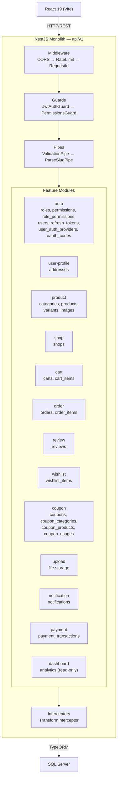
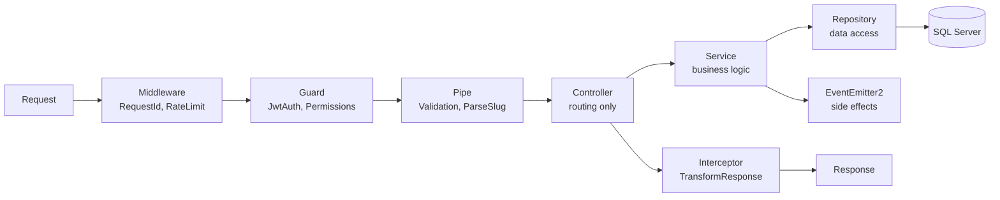
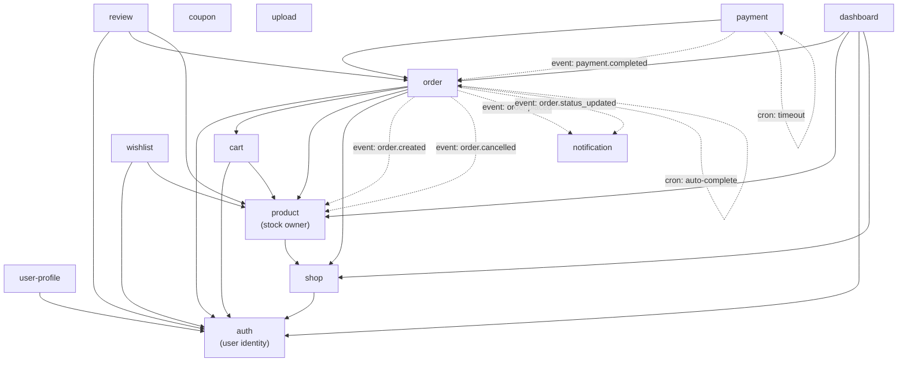

# ARCHITECTURE.md — Backend (NestJS)

## 1. System Overview



**Why monolith?** Single deployable, features map 1:1 to business domains. Each feature owns its entities, logic, and routes — structured for future extraction into microservices if needed.

---

## 2. Folder Structure

```
src/
├── main.ts                              — bootstrap, global pipes/filters/interceptors
├── app.module.ts                        — root module, imports all feature modules + core
│
├── config/
│   ├── app.config.ts                    — port, CORS, global prefix (api/v1)
│   ├── database.config.ts               — TypeORM SQL Server connection
│   ├── jwt.config.ts                    — access secret/expiry (15m), refresh expiry (7d)
│   ├── mail.config.ts                   — SMTP host/port/credentials (Mailtrap for dev)
│   ├── oauth.config.ts                  — Google/Facebook OAuth client IDs/secrets (optional)
│   └── config.module.ts                 — @nestjs/config with .env validation via Joi
│
├── common/                              — shared across all features
│   ├── decorators/                      — @CurrentUser(), @Public(), @Roles(), @Permissions()
│   ├── guards/                          — jwt-auth, roles (legacy), permissions
│   ├── interceptors/                    — transform (response wrapper), logging
│   ├── filters/                         — http-exception (error formatter)
│   ├── pipes/                           — parse-slug
│   ├── dto/                             — pagination.dto.ts (shared)
│   ├── validators/                      — is-vietnamese-phone
│   ├── exceptions/                      — insufficient-stock, cart-empty
│   ├── constants/                       — ORDER_STATUS, PAYMENT enums, PERMISSIONS
│   └── interfaces/                      — paginated-result
│
├── core/                                — initialized once at app bootstrap
│   ├── database/
│   │   ├── database.module.ts           — TypeOrmModule.forRootAsync with SQL Server config
│   │   ├── migrations/                  — timestamp-based migration files
│   │   └── seeds/                       — roles (customer, admin, seller, shipper), permissions, role_permissions, test data
│   ├── mail/
│   │   ├── mail.module.ts               — MailerModule.forRootAsync (HandlebarsAdapter)
│   │   ├── mail.service.ts              — sendVerificationEmail, sendPasswordResetEmail
│   │   └── templates/                   — .hbs email templates (layouts, partials, verify-email, reset-password)
│   └── logger/
│       └── logger.module.ts
│
└── features/
    ├── auth/                            — owns: roles, permissions, role_permissions, users, refresh_tokens, user_auth_providers, oauth_codes
    ├── user-profile/                    — owns: addresses
    ├── product/                         — owns: categories, products, product_variants, product_images
    ├── shop/                            — owns: shops (1:1 with users, seller storefront identity)
    ├── cart/                            — owns: carts, cart_items
    ├── order/                           — owns: orders, order_items
    ├── review/                          — owns: reviews
    ├── wishlist/                        — owns: wishlist_items
    ├── coupon/                          — owns: coupons, coupon_categories, coupon_products, coupon_usages
    ├── upload/                          — file upload (images)
    ├── notification/                   — in-app notifications (order status changes)
    ├── payment/                         — VNPay/MoMo gateway integration, payment_transactions
    └── dashboard/                       — admin, seller & shipper analytics (read-only, no owned entities)
```

---

## 3. Feature Anatomy (Template)

```
src/features/[feature]/
├── [feature].module.ts          — imports, exports, providers
├── [feature].controller.ts      — routes only, delegates to service
├── [feature].service.ts         — business logic, orchestrates repositories
├── repositories/                — one per entity, wraps TypeORM Repository<Entity>
├── dto/                         — create-*, update-*, *-response.dto.ts
├── entities/                    — TypeORM entities (@Entity, relations)
├── types/, utils/, tests/
└── context.md                   — purpose, entities, dependencies, design decisions
```

---

## 4. Request Flow



### Layer Responsibilities

| Layer | Does | Does NOT |
|-------|------|----------|
| **Controller** | Route, extract params (`@CurrentUser`, `@Body`, `@Param`), delegate to service | Contain any business logic |
| **Service** | Business rules, orchestrate repositories, cross-feature calls via DI, emit events | Touch `QueryBuilder` or `EntityManager` directly |
| **Repository** | Data access — TypeORM QueryBuilder, CRUD operations | Make business decisions |

### Concrete Example — POST /api/v1/orders (Checkout)

The most complex cross-feature flow — creates N orders (1 per shop) from a single cart:

```
Request (JWT + CreateOrderDto)
  → RequestIdMiddleware           — attaches X-Request-Id
  → JwtAuthGuard                  — validates token, attaches user
  → RolesGuard                   — checks @Roles('customer')
  → ValidationPipe                — validates CreateOrderDto
  → OrderController.checkout()
    → OrderService.checkout(userId, dto)
      ├── CartService.getCartWithItems(userId)          — [DI] read cart
      ├── Group cart items by shop_id                   — Map<shopId, items[]>
      ├── ProductService.validateAndSnapshotItems()     — [DI] check stock, snapshot name/sku/price
      ├── Generate order_group_id (UUID v4)             — links all sub-orders
      ├── For each shop group:
      │   ├── Calculate shopItemsTotal, proportional discount
      │   ├── OrderRepository.createOrder()             — persist per-shop order + order_items
      │   └── CouponService.recordUsage()               — increment once for entire group
      ├── CartService.clearCart(userId)                  — [DI] clear cart after success
      └── EventEmitter2.emit('order.created', payload)  — [async] per order
          → ProductService.onOrderCreated()             — deducts stock (optimistic lock)
  → TransformInterceptor          — wraps: { success: true, data: CheckoutResponseDto }
  ← 201 Created { order_group_id, orders[], total_amount }
```

---

## 5. Cross-Feature Communication

### Dependency Direction



> **`order.status_updated` event payload** includes `notifyUserIds: number[]` — admin/seller status changes notify the customer; customer confirm-receipt and return-request notify the seller(s). The `NotificationListener` creates one notification per user in the array.

### Two Mechanisms

| Mechanism | When | Example |
|-----------|------|---------|
| **Module exports + DI** | Synchronous, caller needs return value | Order imports CartModule → injects CartService → reads cart at checkout |
| **EventEmitter2** | Async fire-and-forget side effects | `order.created` → product deducts stock; `order.cancelled` → product restores stock |
| **@nestjs/schedule Cron** | Periodic background tasks | `OrderScheduler` auto-completes delivered orders after 7 days (hourly) |

### Dependency Map

| Feature | Imports Modules | Listens To Events |
|---------|----------------|-------------------|
| auth | MailModule *(global module — exports AuthService, guards, permission cache to all features)* | — |
| user-profile | *(via global AuthModule)* | — |
| shop | *(via global AuthModule)* | — |
| product | ShopModule | `order.created`, `order.cancelled` |
| cart | ProductModule | — |
| order | CartModule, ProductModule, ShopModule, CouponModule, ScheduleModule | `payment.completed` (emits `order.status_updated`, has `OrderScheduler` cron). Controllers: `OrderController` (customer), `SellerOrderController` (seller), admin order endpoints |
| review | OrderModule, ProductModule | — |
| wishlist | ProductModule | — |
| coupon | — | — |
| upload | — | — |
| notification | — | `order.placed`, `order.status_updated` |
| payment | OrderModule | — (emits `payment.completed`, has timeout cron) |
| dashboard | TypeOrmModule (Order entity), ShopModule | — (controllers: `AdminDashboardController`, `SellerDashboardController`, `ShipperDashboardController`) |

> **AuthModule is global** — registered via `AuthModule.forRoot()` in AppModule with `global: true`. All features receive AuthService, JwtAuthGuard, PermissionsGuard automatically without explicit imports.

**Forbidden:** direct import of another feature's repository/entity/dto file, circular module dependencies.

---

## 6. Common vs Core

| `common/` | `core/` |
|-----------|---------|
| Reusable across all features | Initialized once at app bootstrap |
| Guards, interceptors, filters, pipes | Database connection (TypeORM) |
| Shared DTOs (`PaginationDto`) | Migration runner, seeds |
| Custom decorators (`@CurrentUser`) | Logger setup |
| Custom exceptions, validators | Future: Redis cache, queue |
| Imported by features as needed | Imported by `AppModule` only |

---

## 7. Configuration

- `config/*.config.ts` registered via `@nestjs/config` `registerAs()`
- Validated at startup with Joi schema — app **crashes immediately** on missing/invalid env vars
- Injected via `ConfigService.get<T>()` — **never** `process.env` directly
- `.env` never committed — `.env.example` with placeholders tracked in git
- Production secrets injected via CI/CD environment variables

---

## 8. Global Providers (main.ts)

| Provider | Registered In | Scope |
|----------|--------------|-------|
| `JwtAuthGuard` | AuthModule (`APP_GUARD`) | Global — `@Public()` to opt out |
| `PermissionsGuard` | AuthModule (`APP_GUARD`) | Global — activates only when `@Permissions()` present, caches per role |
| `ValidationPipe` | main.ts (`useGlobalPipes`) | Global — all DTOs validated, whitelist + forbidNonWhitelisted + transform |
| `TransformInterceptor` | main.ts (`useGlobalInterceptors`) | Global — wraps all success responses |
| `LoggingInterceptor` | main.ts (`useGlobalInterceptors`) | Global — logs method, URL, duration |
| `HttpExceptionFilter` | main.ts (`useGlobalFilters`) | Global — formats all error responses |