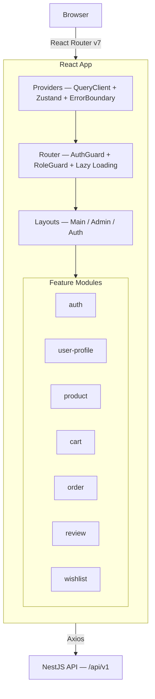
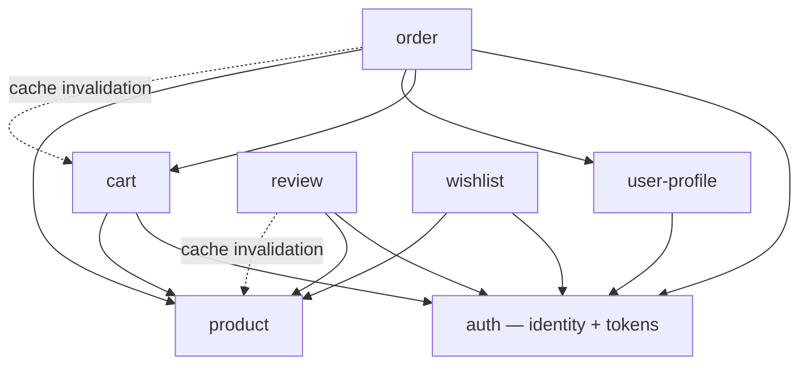

# ARCHITECTURE.md — Frontend (React)

## 1. Overview



**Architecture rationale:**
- **React 19 + Vite** — fast HMR, `use()`, `useOptimistic`, `useActionState`, automatic chunk splitting
- **TanStack Query v5** — server state source of truth, replaces manual state sync between features
- **Zustand** — minimal cross-feature client state (auth tokens, cart badge count)
- **Axios** — interceptors for JWT attach + silent refresh + error transform matching API_SPEC
- **React Router v7** — lazy loading per feature page, URL-driven state for filters/pagination
- **React Hook Form + Zod** — uncontrolled inputs, schema-based validation matching backend DTOs
- **Tailwind v4** — utility-first, no CSS file proliferation

---

## 2. Folder Structure

```
src/
├── main.tsx                           — React root, StrictMode
├── App.tsx                            — wraps Providers + RouterProvider
│
├── core/                              — app-level infrastructure, initialized once
│   ├── providers/
│   │   ├── AppProviders.tsx           — composes QueryClient + Zustand + ErrorBoundary
│   │   └── query-client.ts            — staleTime 5min products, 0 cart, retry 1 mutations
│   ├── router/
│   │   ├── router.tsx                 — createBrowserRouter, lazy-loaded feature pages
│   │   ├── AuthGuard.tsx              — redirects /login if !isAuthenticated
│   │   └── RoleGuard.tsx              — redirects /403 if role !== required
│   ├── api/
│   │   ├── axios-instance.ts          — baseURL, JWT interceptor, 401 refresh, error transform
│   │   └── api.types.ts               — SuccessResponse<T>, PaginatedResponse<T>, ApiError
│   └── layouts/
│       ├── MainLayout.tsx             — header (nav, cart badge, user menu) + outlet + footer
│       ├── AdminLayout.tsx            — admin sidebar + outlet
│       └── AuthLayout.tsx             — centered card for login/register
│
├── shared/                            — reusable, no business logic
│   ├── components/
│   │   ├── ui/                        — Button, Input, Modal, Badge, Skeleton, Spinner, Table
│   │   ├── form/                      — FormInput, FormSelect, FormTextarea (RHF integrated)
│   │   ├── feedback/                  — EmptyState, ErrorBoundary, Toast
│   │   └── data/                      — Pagination, SortableHeader, FilterBar
│   ├── hooks/                         — useDebounce, usePagination, useMediaQuery
│   ├── utils/                         — formatPrice (VND), formatDate, truncateText, storage
│   ├── types/                         — PaginationParams, SelectOption, SortParams
│   └── constants/                     — ROUTES, ORDER_STATUS_LABELS, PAYMENT_STATUS_LABELS
│
├── features/
│   ├── auth/                          — login, register, token refresh, logout
│   ├── user-profile/                  — profile view/edit, address CRUD, default address
│   ├── product/                       — listing, detail, category tree, admin CRUD
│   ├── cart/                          — cart view, add/update/remove, guest cart, merge
│   ├── order/                         — checkout, order history, detail, admin management
│   ├── review/                        — create review, product reviews, my reviews
│   └── wishlist/                      — add/remove products, wishlist page, admin popular
│
├── assets/                            — static images, fonts
└── styles/
    └── globals.css                    — Tailwind directives, CSS custom properties
```

---

## 3. Feature Anatomy

Example: `src/features/cart/`

```
cart/
├── components/
│   ├── CartPage.tsx                   — page: composes CartItemList + CartSummary
│   ├── CartItemList.tsx               — renders items, quantity change + remove
│   ├── CartItemRow.tsx                — single item: variant info, quantity, remove
│   ├── CartSummary.tsx                — subtotal, shipping, checkout button
│   ├── CartBadge.tsx                  — header icon + itemCount from useCartStore
│   ├── AddToCartButton.tsx            — exported via barrel, used by product feature
│   ├── CartPageSkeleton.tsx           — loading skeleton
│   └── *.test.tsx                     — co-located tests
├── hooks/
│   ├── useCart.ts                     — useQuery(['cart'], cartService.getCart)
│   ├── useAddToCart.ts                — useMutation, optimistic update + rollback
│   ├── useUpdateCartItem.ts           — useMutation, optimistic
│   ├── useRemoveCartItem.ts           — useMutation, optimistic
│   └── useMergeCart.ts                — useMutation, called on login success
├── services/
│   └── cart.service.ts                — getCart, addItem, updateItem, removeItem, merge
├── stores/
│   └── cart.store.ts                  — useCartStore: { itemCount, setItemCount }
├── types/
│   └── cart.types.ts                  — Cart, CartItem, AddToCartRequest
├── utils/
│   └── cart.util.ts                   — calculateSubtotal, isCartEmpty
├── index.ts                           — barrel: CartPage, CartBadge, AddToCartButton, hooks, store, types
└── context.md
```

---

## 4. Data Flow

### Read Flow — Product Listing

```
User visits /products?category_id=5&page=2
  │
  ├─ ① React Router       — extracts searchParams
  ├─ ② ProductListPage    — reads params via usePagination + useSearchParams
  ├─ ③ useProducts(params) — TanStack Query checks cache
  │     Cache miss → productService.getProducts(params)
  │       → Axios GET /api/v1/products?category_id=5&page=2
  │       → Request interceptor attaches JWT (optional, @Public)
  │       → Response: { success, data, meta }
  │       → TanStack Query caches result
  ├─ ④ Render              — ProductCard[] + Pagination
  └─ ⑤ Prefetch            — hover ProductCard → prefetchQuery(productKeys.detail(slug))
```

### Write Flow — Add to Cart (Optimistic)

```
User clicks AddToCartButton(variantId, quantity)
  │
  ├─ ① useAddToCart mutation fires
  ├─ ② onMutate            — snapshot cache → optimistically add item → update cartStore.itemCount
  ├─ ③ Axios POST           — /api/v1/cart/items
  ├─ ④ Success: onSettled   — invalidate ['cart'] (refetch server truth)
  └─ ⑤ Error: onError       — rollback cache to snapshot, show toast (CART_003 / CART_004)
```

### Auth Flow — Login + Cart Merge

```
User submits login form
  │
  ├─ ① useLogin mutation → POST /api/v1/auth/login
  ├─ ② Success              — useAuthStore.login(accessToken, refreshToken, user)
  ├─ ③ Check localStorage   — guest session_id exists?
  │     Yes → useMergeCart → POST /api/v1/cart/merge { session_id }
  │          → clear session_id from localStorage
  │          → invalidate ['cart']
  └─ ④ Navigate              — to previous page or /
```

### Silent Token Refresh — Axios Interceptor

```
Any API call returns 401 (AUTH_002)
  │
  ├─ ① Interceptor catches 401
  ├─ ② POST /api/v1/auth/refresh { refreshToken }
  ├─ ③ Success → update useAuthStore tokens → retry original request
  └─ ④ Failure (AUTH_003) → useAuthStore.logout() → redirect /login
```

---

## 5. Cross-Feature Communication

### Dependency Direction



### Communication Methods

| Method | Use Case | Example |
|--------|----------|---------|
| **Zustand store** | Auth state consumed everywhere | `useAuthStore`: isAuthenticated, user, role → read by guards, header, cart merge |
| **Zustand store** | Cart badge in header | `useCartStore`: itemCount → written by cart hooks, read by MainLayout |
| **TanStack cache invalidation** | Cross-feature side effects | Checkout success → invalidate `['cart']` + `['orders', 'list']` |
| **Barrel exports** | Composing UI from multiple features | CheckoutPage imports `CartItemList` from `@/features/cart` |
| **URL params** | Feature-to-feature navigation | ProductCard links to `/products/:slug`, OrderItemRow links back to product |
| **Props at page level** | Page composes multiple features | ProductDetailPage renders `AddToCartButton` (cart) + `ReviewList` (review) + `WishlistButton` (wishlist) |

---

## 6. Routing Structure

### Public Routes (no auth)

| Path | Page | Feature |
|------|------|---------|
| `/` | Home (product listing) | product |
| `/products` | ProductListPage | product |
| `/products/:slug` | ProductDetailPage | product + cart + review + wishlist |
| `/categories/:slug` | CategoryPage | product |
| `/login` | LoginPage | auth |
| `/register` | RegisterPage | auth |

### Protected Routes (AuthGuard)

| Path | Page | Feature |
|------|------|---------|
| `/cart` | CartPage | cart |
| `/checkout` | CheckoutPage | order + cart + user-profile |
| `/orders` | OrderHistoryPage | order |
| `/orders/:id` | OrderDetailPage | order |
| `/profile` | ProfilePage | user-profile |
| `/profile/addresses` | AddressListPage | user-profile |
| `/wishlist` | WishlistPage | wishlist |

### Admin Routes (AuthGuard + RoleGuard)

| Path | Page | Feature |
|------|------|---------|
| `/admin/products` | AdminProductListPage | product |
| `/admin/products/new` | AdminProductCreatePage | product |
| `/admin/products/:id/edit` | AdminProductEditPage | product |
| `/admin/orders` | AdminOrderListPage | order |
| `/admin/orders/:id` | AdminOrderDetailPage | order |
| `/admin/wishlist` | AdminWishlistPopularPage | wishlist |

**Config:** `createBrowserRouter` in `core/router/router.tsx`. Each page lazy-loaded via `React.lazy`. Layouts as route parents. 404 catch-all → NotFoundPage.

---

## 7. State Management Strategy

| State Type | Tool | Location | Example |
|------------|------|----------|---------|
| Server state | TanStack Query | feature hooks | Products, orders, cart items, reviews |
| Auth state | Zustand | `features/auth/stores` | accessToken, user, role, isAuthenticated |
| Cart badge | Zustand | `features/cart/stores` | itemCount — derived from TanStack Query cart data |
| URL state | React Router | searchParams | page, limit, category_id, sort, search |
| Form state | React Hook Form | component-local | Checkout, review, login forms — Zod-validated |
| UI state | React useState | component-local | Modal open, dropdown, image gallery index, variant selection |

**Rule:** API data → TanStack Query. Cross-feature client-only → Zustand. URL-representable → searchParams. Everything else → `useState`.

---

## 8. API Layer

### 4-Layer Architecture

```
core/api/axios-instance.ts              — base client, JWT interceptor, 401 refresh, error transform
    ↓
features/[x]/services/[x].service.ts    — typed functions, 1:1 to API_SPEC endpoints
    ↓
features/[x]/hooks/use[Action].ts       — TanStack Query wrappers, cache keys, optimistic updates
    ↓
features/[x]/components/[X].tsx          — calls hooks, renders data/loading/error, never touches Axios
```

### Query Key Factory

```typescript
export const productKeys = {
  all:    ['products'] as const,
  list:   (filters: ProductListParams) => ['products', 'list', filters] as const,
  detail: (slug: string) => ['products', 'detail', slug] as const,
};

export const cartKeys = {
  current: () => ['cart'] as const,
};

export const orderKeys = {
  list:   (params: OrderListParams) => ['orders', 'list', params] as const,
  detail: (id: number) => ['orders', 'detail', id] as const,
  admin:  (filters: AdminOrderFilters) => ['admin', 'orders', filters] as const,
};

export const wishlistKeys = {
  all:       ['wishlist'] as const,
  list:      (params: WishlistListParams) => ['wishlist', 'list', params] as const,
  check:     (productId: number) => ['wishlist', 'check', productId] as const,
  bulkCheck: (productIds: number[]) => ['wishlist', 'bulkCheck', productIds] as const,
};
```

### Cache Invalidation Map

| Trigger | Invalidate |
|---------|------------|
| Checkout success | `cartKeys.current()` + `orderKeys.list()` |
| Cart item add/update/remove | `cartKeys.current()` → update `useCartStore.itemCount` |
| Review created | `reviewKeys.list(productId)` + `productKeys.detail(slug)` |
| Login + cart merge | `cartKeys.current()` |
| Wishlist add/remove | `wishlistKeys.all` + `wishlistKeys.check(productId)` |

---

## 9. Shared vs Features

| `shared/` | `features/` |
|-----------|-------------|
| UI primitives: Button, Input, Modal, Skeleton, Badge, Table | Domain components: ProductCard, CartItemRow, OrderStatusBadge, ReviewForm |
| Generic hooks: useDebounce, usePagination, useMediaQuery | Domain hooks: useProducts, useCart, useCreateOrder, useLogin |
| Format utils: formatPrice, formatDate, truncateText | Domain utils: calculateSubtotal, isOrderCancellable |
| Shared types: PaginationParams, SelectOption | Domain types: Product, CartItem, Order, CreateOrderRequest |
| Route constants, status labels | Feature pages, feature stores |
| No business logic, no API knowledge | Owns business domain, calls API via services |