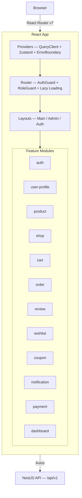
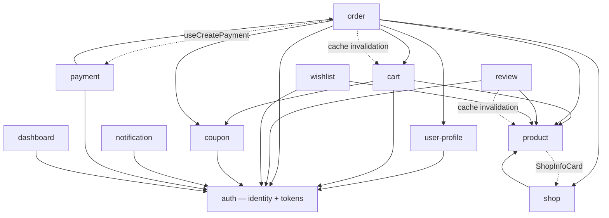

# ARCHITECTURE.md — Frontend (React)

## 1. Overview



**Architecture rationale:**
- **React 19 + Vite** — fast HMR, `use()`, `useOptimistic`, `useActionState`, automatic chunk splitting
- **TanStack Query v5** — server state source of truth, replaces manual state sync between features
- **Zustand** — minimal cross-feature client state (auth tokens, cart badge count)
- **Axios** — interceptors for JWT attach + silent refresh + error transform matching API_SPEC
- **React Router v7** — lazy loading per feature page, URL-driven state for filters/pagination
- **React Hook Form + Zod** — uncontrolled inputs, schema-based validation matching backend DTOs
- **Tailwind v4** — utility-first, no CSS file proliferation

---

## 2. Folder Structure

```
src/
├── main.tsx                           — React root, StrictMode
├── App.tsx                            — wraps Providers + RouterProvider
│
├── core/                              — app-level infrastructure, initialized once
│   ├── providers/                     — AppProviders (QueryClient + Zustand + ErrorBoundary), query-client config
│   ├── router/                        — createBrowserRouter, AuthGuard, PortalGuard, lazy-loaded pages
│   ├── api/                           — axios-instance (JWT interceptor, 401 refresh, error transform), api.types
│   └── layouts/                       — MainLayout, AdminLayout, SellerLayout, ShipperLayout, AuthLayout, AccountLayout
│
├── shared/                            — reusable UI primitives, hooks, utils, types, constants (no business logic)
│   ├── components/                    — ui/ (Button, Input, Modal, Badge, Skeleton, Table), form/ (RHF wrappers), feedback/, data/ (Pagination, FilterBar)
│   ├── hooks/                         — useDebounce, usePagination, useMediaQuery
│   ├── utils/                         — formatPrice (VND), formatDate, truncateText, storage
│   ├── types/                         — PaginationParams, SelectOption, SortParams
│   └── constants/                     — ROUTES, ORDER_STATUS_LABELS, PAYMENT_STATUS_LABELS
│
├── features/
│   ├── auth/                          — login, register, token refresh, logout, admin roles/permissions/users
│   ├── user-profile/                  — profile view/edit, address CRUD, default address
│   ├── product/                       — listing, detail, category tree, admin CRUD
│   ├── shop/                          — public shop profile, seller shop settings
│   ├── cart/                          — cart view, add/update/remove, guest cart, merge
│   ├── order/                         — checkout, order history, detail, admin management
│   ├── review/                        — create review, product reviews, my reviews, admin reviews
│   ├── wishlist/                      — add/remove products, wishlist page, admin popular
│   ├── coupon/                        — coupon validation, admin CRUD, usage tracking
│   ├── notification/                  — notification bell, dropdown, polling, notification page
│   ├── payment/                       — VNPay/MoMo gateway redirect, payment result, transaction list
│   └── dashboard/                     — admin, seller & shipper analytics dashboards (charts, stats, alerts)
│
├── assets/                            — static images, fonts
└── styles/
    └── globals.css                    — Tailwind directives, CSS custom properties
```

---

## 3. Feature Anatomy

```
src/features/[feature]/
├── pages/             — route-level pages (default export for React.lazy)
├── components/        — UI components + co-located *.test.tsx
├── hooks/             — TanStack Query wrappers (useQuery/useMutation), query key factory
├── services/          — typed Axios calls, 1:1 to API_SPEC endpoints
├── stores/            — Zustand (only if cross-feature client state needed)
├── types/             — request/response types, domain models
├── utils/             — feature-specific helpers
├── index.ts           — barrel file: public exports only
└── context.md         — purpose, pages, API deps, state decisions
```

---

## 4. Data Flow

### Write Flow — Add to Cart (Optimistic)

```
User clicks AddToCartButton(variantId, quantity)
  │
  ├─ ① useAddToCart mutation fires
  ├─ ② onMutate            — snapshot cache → optimistically add item → update cartStore.itemCount
  ├─ ③ Axios POST           — /api/v1/cart/items
  ├─ ④ Success: onSettled   — invalidate ['cart'] (refetch server truth)
  └─ ⑤ Error: onError       — rollback cache to snapshot, show toast (CART_003 / CART_004)
```

### Auth Flow — Login + Cart Merge

```
User submits login form
  │
  ├─ ① useLogin mutation → POST /api/v1/auth/login
  ├─ ② Success              — useAuthStore.login(accessToken, refreshToken, user)
  ├─ ③ Check localStorage   — guest session_id exists?
  │     Yes → useMergeCart → POST /api/v1/cart/merge { session_id }
  │          → clear session_id from localStorage
  │          → invalidate ['cart']
  └─ ④ Navigate              — to previous page or /
```

### Silent Token Refresh — Axios Interceptor

```
Any API call returns 401 (AUTH_002)
  │
  ├─ ① Interceptor catches 401
  ├─ ② POST /api/v1/auth/refresh { refreshToken }
  ├─ ③ Success → update useAuthStore tokens → retry original request
  └─ ④ Failure (AUTH_003) → useAuthStore.logout() → redirect /login
```

---

## 5. Cross-Feature Communication

### Dependency Direction



### Communication Methods

| Method | Use Case | Example |
|--------|----------|---------|
| **Zustand store** | Auth state consumed everywhere | `useAuthStore`: isAuthenticated, user, role → read by guards, header, cart merge |
| **Zustand store** | Cart badge in header | `useCartStore`: itemCount → written by cart hooks, read by MainLayout |
| **Zustand store** | Notification badge in header + sidebar | `useNotificationStore`: unreadCount → written by polling hook, read by bell + account sidebar |
| **Zustand store** | Voucher selection shared Cart ↔ Checkout | `useAppliedCouponsStore` (feature `coupon`): applied vouchers → written by both the Cart page and Checkout, cleared on order/logout |
| **TanStack cache invalidation** | Cross-feature side effects | Checkout success → invalidate `['cart']` + `['orders', 'list']` |
| **Barrel exports** | Composing UI from multiple features | CheckoutPage imports `useCart` + `cartSignature` from `@/features/cart`, `CouponPicker` from `@/features/coupon` |
| **URL params** | Feature-to-feature navigation | ProductCard links to `/products/:slug`, OrderItemRow links back to product |
| **Props at page level** | Page composes multiple features | ProductDetailPage renders `AddToCartButton` (cart) + `ReviewList` (review) + `WishlistButton` (wishlist) |

---

## 6. Routing

All routes defined in `core/router/router.tsx`. Each page lazy-loaded via `React.lazy`. Layouts as route parents (`MainLayout`, `AuthLayout`, `AdminLayout`, `SellerLayout`, `ShipperLayout`). Guards: `AuthGuard` → `/login`, `PortalGuard` → `/403`. 404 catch-all → NotFoundPage.

---

## 7. State Management Strategy

| State Type | Tool | Location | Example |
|------------|------|----------|---------|
| Server state | TanStack Query | feature hooks | Products, orders, cart items, reviews |
| Auth state | Zustand | `features/auth/stores` | accessToken, user, role, isAuthenticated |
| Cart badge | Zustand | `features/cart/stores` | itemCount — derived from TanStack Query cart data |
| Voucher selection | Zustand | `features/coupon/stores` | `useAppliedCouponsStore` — user's picked vouchers, shared Cart ↔ Checkout; not persisted |
| Notification badge | Zustand | `features/notification/stores` | unreadCount — synced from polling query every 30s |
| URL state | React Router | searchParams | page, limit, category_id, sort, search |
| Form state | React Hook Form | component-local | Checkout, review, login forms — Zod-validated |
| UI state | React useState | component-local | Modal open, dropdown, image gallery index, variant selection |

**Rule:** API data → TanStack Query. Cross-feature client-only → Zustand. URL-representable → searchParams. Everything else → `useState`.

---

## 8. API Layer

### 4-Layer Architecture

```
core/api/axios-instance.ts              — base client, JWT interceptor, 401 refresh, error transform
    ↓
features/[x]/services/[x].service.ts    — typed functions, 1:1 to API_SPEC endpoints
    ↓
features/[x]/hooks/use[Action].ts       — TanStack Query wrappers, cache keys, optimistic updates
    ↓
features/[x]/components/[X].tsx          — calls hooks, renders data/loading/error, never touches Axios
```

### Cache Invalidation Map

| Trigger | Invalidate |
|---------|------------|
| Checkout success | `cartKeys.current()` + `orderKeys.list()` (checkout returns `{ order_group_id, orders[], total_amount }`) |
| Cart item add/update/remove | `cartKeys.current()` → update `useCartStore.itemCount` |
| Review created | `reviewKeys.list(productId)` + `productKeys.detail(slug)` |
| Login + cart merge | `cartKeys.current()` |
| Wishlist add/remove | `wishlistKeys.all` + `wishlistKeys.check(productId)` |
| Admin coupon create/update/deactivate | `adminCouponKeys.all` |
| Seller shop create/update | `['seller', 'shop']` |
| Checkout success / cancel order | `notificationKeys.all` (new notifications may exist) |
| Payment created (VNPay/MoMo) | Redirects to gateway via `{ order_group_id }` — no cache change (page unloads) |
| Payment result page loads | `orderKeys.group(groupId)` or `orderKeys.detail(id)` + `paymentKeys.byOrder(id)` (fresh data after redirect) |
| Mark read / mark all read | `notificationKeys.all` + `notificationKeys.unreadCount()` → update `useNotificationStore.unreadCount` |

---

## 9. Shared vs Features

| `shared/` | `features/` |
|-----------|-------------|
| UI primitives: Button, Input, Modal, Skeleton, Badge, Table | Domain components: ProductCard, CartItemRow, OrderStatusBadge, ReviewForm |
| Generic hooks: useDebounce, usePagination, useMediaQuery | Domain hooks: useProducts, useCart, useCreateOrder, useLogin |
| Format utils: formatPrice, formatDate, truncateText | Domain utils: calculateSubtotal, isOrderCancellable |
| Shared types: PaginationParams, SelectOption | Domain types: Product, CartItem, Order, CreateOrderRequest |
| Route constants, status labels | Feature pages, feature stores |
| No business logic, no API knowledge | Owns business domain, calls API via services |