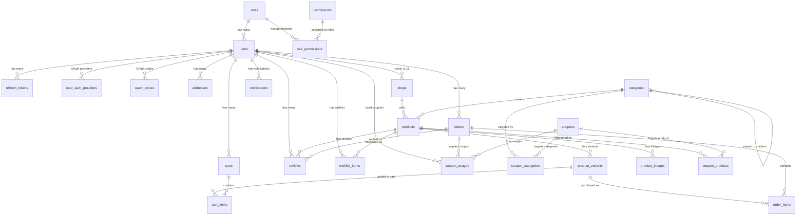

# DATABASE.md — Ecommerce Shop

## 1. Overview

- **Database:** SQL Server
- **ORM:** TypeORM (NestJS integration)
- **Naming conventions:**
  - Tables & columns: `snake_case`
  - Indexes: `idx_{table}_{column}`
- **Unicode:** All string columns use `NVARCHAR` (Vietnamese product names, addresses)
- **Timestamps:** `DATETIME2` with `SYSUTCDATETIME()` default — store UTC, convert in app layer
- **Money:** `DECIMAL(10,2)` — never use `FLOAT`
- **Booleans:** `BIT` (`1`/`0`)

---

## 2. Entities by Feature

### 2.1 Auth Feature

#### `roles`

| Field | Type | Constraints |
|-------|------|-------------|
| id | INT | PK, auto-increment |
| name | NVARCHAR(50) | NOT NULL, UNIQUE — `customer`, `admin`, `seller`, `shipper` |
| is_system | BIT | NOT NULL, DEFAULT `0` — system roles cannot be deleted |

#### `permissions`

| Field | Type | Constraints |
|-------|------|-------------|
| id | INT | PK, auto-increment |
| name | NVARCHAR(100) | NOT NULL — human-readable label (e.g. "Create Product") |
| resource | NVARCHAR(50) | NOT NULL — resource key (e.g. `products`, `orders`, `dashboard`) |
| action | NVARCHAR(50) | NOT NULL — action key (e.g. `create`, `read`, `update`, `delete`) |
| description | NVARCHAR(255) | NULL |
| created_at | DATETIME2 | NOT NULL, DEFAULT `SYSUTCDATETIME()` |
| updated_at | DATETIME2 | NOT NULL, DEFAULT `SYSUTCDATETIME()` |

**Constraints:** UNIQUE `(resource, action)` — `uq_permissions_resource_action`

> **Dynamic RBAC:** Permissions are stored as `resource:action` strings (e.g. `products:create`). Admin endpoints use `@Permissions(PERMISSIONS.PRODUCTS_CREATE)` decorator instead of role-based `@Roles()`. Permission strings are defined in `common/constants/permissions.constant.ts`.

#### `role_permissions` — Junction

| Field | Type | Constraints |
|-------|------|-------------|
| id | INT | PK, auto-increment |
| role_id | INT | FK → `roles.id`, NOT NULL, CASCADE delete |
| permission_id | INT | FK → `permissions.id`, NOT NULL, CASCADE delete |

**Constraints:** UNIQUE `(role_id, permission_id)` — `uq_role_permissions_role_permission`

> **Role-permission mapping:** Admin role gets all permissions. Seller gets products CRUD + categories read + orders read + uploads + dashboard. Shipper gets orders read/update + dashboard. Customer has no admin permissions (all customer actions are handled by JWT auth, not permission checks).

#### `users`

| Field | Type | Constraints |
|-------|------|-------------|
| id | INT | PK, auto-increment |
| role_id | INT | FK → `roles.id`, NOT NULL |
| email | NVARCHAR(255) | NOT NULL, UNIQUE |
| password_hash | NVARCHAR(255) | NULL — bcrypt hash, **never** store plain text. NULL for OAuth-only users |
| full_name | NVARCHAR(100) | NOT NULL |
| phone | NVARCHAR(20) | NULL |
| email_verified | BIT | NOT NULL, DEFAULT `0` — must verify email before login |
| email_verify_token | NVARCHAR(255) | NULL — SHA-256 hash of 6-digit OTP |
| email_verify_expires | DATETIME2 | NULL — OTP expiry (5 minutes) |
| email_verify_count | INT | NOT NULL, DEFAULT `0` — resend counter (max 5/hour) |
| email_verify_count_reset | DATETIME2 | NULL — resets counter each hour |
| email_verify_attempts | INT | NOT NULL, DEFAULT `0` — failed verify attempts (max 5 before new OTP required) |
| password_reset_token_hash | NVARCHAR(255) | NULL — SHA-256 hash of reset token |
| password_reset_expires_at | DATETIME2 | NULL — reset token expiry (1 hour) |
| is_active | BIT | NOT NULL, DEFAULT `1` — soft ban without deleting data |
| created_at | DATETIME2 | NOT NULL, DEFAULT `SYSUTCDATETIME()` |
| updated_at | DATETIME2 | NOT NULL, DEFAULT `SYSUTCDATETIME()` |

> **Shared entity** — referenced by Order, Review, Cart, and User Profile features.
> **OAuth users** have `password_hash = NULL` — they authenticate via `user_auth_providers` instead. Use `POST /auth/set-password` to add a local password.
> **Email verification** blocks login until `email_verified = true`. OTP sent via email on registration.

#### `refresh_tokens`

| Field | Type | Constraints |
|-------|------|-------------|
| id | INT | PK, auto-increment |
| user_id | INT | FK → `users.id`, NOT NULL |
| token_hash | NVARCHAR(255) | NOT NULL — hashed, **never** store plain |
| expires_at | DATETIME2 | NOT NULL |
| created_at | DATETIME2 | NOT NULL, DEFAULT `SYSUTCDATETIME()` |
| is_revoked | BIT | NOT NULL, DEFAULT `0` — soft revoke on logout/password change |
| ip_address | NVARCHAR(45) | NULL — supports IPv4/IPv6 |
| user_agent | NVARCHAR(500) | NULL |
| device_name | NVARCHAR(100) | NULL — e.g. "Chrome on Windows" |

> **Multi-device support:** One user → many tokens. Soft revoke via `is_revoked` instead of hard delete for audit trail.

#### `user_auth_providers` — OAuth Multi-Provider

| Field | Type | Constraints |
|-------|------|-------------|
| id | INT | PK, auto-increment |
| user_id | INT | FK → `users.id`, NOT NULL, CASCADE delete |
| provider | NVARCHAR(20) | NOT NULL — `'google'`, `'facebook'` |
| provider_id | NVARCHAR(255) | NOT NULL — ID from OAuth provider |
| created_at | DATETIME2 | NOT NULL, DEFAULT `SYSUTCDATETIME()` |

**Constraints:**
- UNIQUE `(provider, provider_id)` — `uq_user_auth_providers_provider_provider_id` — one OAuth identity maps to one user
- UNIQUE `(user_id, provider)` — `uq_user_auth_providers_user_provider` — one user per provider (can't link two Google accounts)

> **Multi-provider design:** Replaces single `provider`/`provider_id` columns on `users`. Each user can link multiple OAuth providers (e.g. both Google and Facebook). When an OAuth login matches an existing user by email, a new `user_auth_providers` record is created (account linking). Users with `password_hash = NULL` are OAuth-only; they can add a local password via `POST /auth/set-password`.

#### `oauth_codes` — One-Time Authorization Codes

| Field | Type | Constraints |
|-------|------|-------------|
| id | INT | PK, auto-increment |
| code_hash | NVARCHAR(255) | NOT NULL — SHA-256 hash of one-time code |
| user_id | INT | FK → `users.id`, NOT NULL |
| expires_at | DATETIME2 | NOT NULL — TTL 60 seconds |
| created_at | DATETIME2 | NOT NULL, DEFAULT `SYSUTCDATETIME()` |

> **Security flow:** OAuth callback generates a one-time code → stores SHA-256 hash in `oauth_codes` → redirects to frontend with raw code → frontend exchanges code for JWT tokens via `POST /auth/oauth/exchange` → backend deletes the code record before returning tokens (atomic find+delete prevents replay). Cleanup cron deletes expired codes every 10 minutes.

---

### 2.2 User Profile Feature

#### `addresses`

| Field | Type | Constraints |
|-------|------|-------------|
| id | INT | PK, auto-increment |
| user_id | INT | FK → `users.id`, NOT NULL |
| full_name | NVARCHAR(100) | NOT NULL — recipient name, can differ from account name |
| phone | NVARCHAR(20) | NOT NULL |
| address_line | NVARCHAR(255) | NOT NULL — street number, street name |
| city | NVARCHAR(100) | NOT NULL |
| is_default | BIT | NOT NULL, DEFAULT `0` — marks default address for checkout |

---

### 2.3 Shop Feature

#### `shops`

| Field | Type | Constraints |
|-------|------|-------------|
| id | INT | PK, auto-increment |
| user_id | INT | FK → `users.id`, NOT NULL, UNIQUE — 1:1 relationship |
| name | NVARCHAR(100) | NOT NULL |
| slug | NVARCHAR(100) | NOT NULL, UNIQUE — SEO-friendly URL, immutable after creation |
| description | NVARCHAR(MAX) | NULL |
| logo_url | NVARCHAR(500) | NULL |
| banner_url | NVARCHAR(500) | NULL |
| status | NVARCHAR(30) | NOT NULL, DEFAULT `'pending_verification'`, CHECK IN (`pending_verification`, `active`, `suspended`, `banned`) |
| verified_at | DATETIME2 | NULL — set when admin approves (preserved permanently) |
| verified_by | INT | FK → `users.id` ON DELETE SET NULL, NULL — admin who approved |
| suspended_at | DATETIME2 | NULL — set on latest suspension |
| banned_at | DATETIME2 | NULL — set on ban |
| created_at | DATETIME2 | NOT NULL, DEFAULT `SYSUTCDATETIME()` |
| updated_at | DATETIME2 | NOT NULL, DEFAULT `SYSUTCDATETIME()` |

> **1:1 with users:** Each seller has exactly one shop. UNIQUE constraint on `user_id` enforces this. Race condition on concurrent POST handled by catching SQL Server error 2627/2601 → mapped to SHOP_002.
> **Status lifecycle:** `pending_verification` → `active` → `suspended`/`banned`. `verified_at`/`verified_by` are set once on first approval and preserved permanently. `suspended_at`/`banned_at` are overwritten on each state change.
> **Public visibility:** Products from shops with `status != 'active'` are hidden from the public storefront. All public product queries join shops and filter `shops.status = 'active'`.

---

### 2.4 Product Catalog Feature

#### `categories`

| Field | Type | Constraints |
|-------|------|-------------|
| id | INT | PK, auto-increment |
| parent_id | INT | FK → `categories.id`, NULL — self-referencing for N-level hierarchy |
| name | NVARCHAR(100) | NOT NULL |
| slug | NVARCHAR(100) | NOT NULL, UNIQUE — SEO-friendly URL |

> **Self-referencing hierarchy:** `parent_id = NULL` means root category. Example: Fashion → Shirts → T-shirts.

#### `products`

| Field | Type | Constraints |
|-------|------|-------------|
| id | INT | PK, auto-increment |
| category_id | INT | FK → `categories.id`, NOT NULL |
| shop_id | INT | FK → `shops.id`, NULL — links product to seller's shop |
| name | NVARCHAR(255) | NOT NULL |
| slug | NVARCHAR(255) | NOT NULL, UNIQUE — SEO-friendly URL |
| description | NVARCHAR(MAX) | NULL |
| thumbnail_url | NVARCHAR(500) | NULL — main display image |
| option1_label | NVARCHAR(50) | NULL — label for variant axis 1 (e.g. "Màu sắc", "Color") |
| option2_label | NVARCHAR(50) | NULL — label for variant axis 2 (e.g. "Kích thước", "Size") |
| is_active | BIT | NOT NULL, DEFAULT `1` — hide instead of hard delete |
| created_at | DATETIME2 | NOT NULL, DEFAULT `SYSUTCDATETIME()` |
| updated_at | DATETIME2 | NOT NULL, DEFAULT `SYSUTCDATETIME()` |

> **Flexible variant axes:** Products define their own option labels. A clothing product might use "Color" + "Size", while a phone uses "Storage" + "Color". Labels are snapshotted into `order_items.variant_option*_label` at checkout.

#### `product_variants` ⚠️ Transaction Hub

| Field | Type | Constraints |
|-------|------|-------------|
| id | INT | PK, auto-increment |
| product_id | INT | FK → `products.id`, NOT NULL |
| sku | NVARCHAR(50) | NOT NULL, UNIQUE — unique identifier per variant |
| option1 | NVARCHAR(50) | NULL — value for axis 1 (e.g. "Đen", "Black") |
| option2 | NVARCHAR(50) | NULL — value for axis 2 (e.g. "L", "128GB") |
| price | DECIMAL(10,2) | NOT NULL — original price |
| sale_price | DECIMAL(10,2) | NULL — promotional price |
| stock_quantity | INT | NOT NULL, DEFAULT `0` |

> **Critical design decision:** `cart_items` and `order_items` FK to `product_variants`, **NOT** to `products`. Each combination of option1 + option2 = 1 separate variant row. Columns are generic (`option1`/`option2`) instead of domain-specific (`color`/`size`) to support any product type.

#### `product_images`

| Field | Type | Constraints |
|-------|------|-------------|
| id | INT | PK, auto-increment |
| product_id | INT | FK → `products.id`, NOT NULL |
| image_url | NVARCHAR(500) | NOT NULL |
| sort_order | INT | NOT NULL, DEFAULT `0` — display order |

---

### 2.5 Cart Feature

#### `carts`

| Field | Type | Constraints |
|-------|------|-------------|
| id | INT | PK, auto-increment |
| user_id | INT | FK → `users.id`, NULL — **nullable** for guest cart support |
| session_id | NVARCHAR(100) | NULL — identifies guest cart before login |
| created_at | DATETIME2 | NOT NULL, DEFAULT `SYSUTCDATETIME()` |

> **Guest cart flow:** Guest browses → `user_id = NULL`, `session_id = 'abc123'` → User logs in → merge guest cart into user cart → set `user_id`, clear `session_id`.

#### `cart_items`

| Field | Type | Constraints |
|-------|------|-------------|
| id | INT | PK, auto-increment |
| cart_id | INT | FK → `carts.id`, NOT NULL |
| product_variant_id | INT | FK → `product_variants.id`, NOT NULL |
| quantity | INT | NOT NULL, CHECK (`quantity > 0`) |

---

### 2.6 Order Feature

#### `orders`

| Field | Type | Constraints |
|-------|------|-------------|
| id | INT | PK, auto-increment |
| user_id | INT | FK → `users.id`, NOT NULL |
| status | NVARCHAR(20) | NOT NULL, DEFAULT `'pending'` — `pending` / `confirmed` / `shipping` / `delivered` / `completed` / `return_requested` / `cancelled` |
| payment_method | NVARCHAR(20) | NOT NULL — `cod` / `banking` / `momo` |
| payment_status | NVARCHAR(20) | NOT NULL, DEFAULT `'unpaid'` — `unpaid` / `paid` |
| shipping_fee | DECIMAL(10,2) | NOT NULL, DEFAULT `0` |
| total_amount | DECIMAL(10,2) | NOT NULL |
| shipping_address | NVARCHAR(MAX) | NOT NULL — **JSON snapshot**, NOT FK to addresses |
| coupon_code | NVARCHAR(50) | NULL — **snapshot** of applied coupon code |
| discount_amount | DECIMAL(10,2) | NOT NULL, DEFAULT `0` |
| delivered_at | DATETIME2 | NULL — set when order transitions to `delivered`, used by auto-complete cron |
| created_at | DATETIME2 | NOT NULL, DEFAULT `SYSUTCDATETIME()` |

> **Key decisions:**
> - `shipping_address` is a JSON snapshot — preserves the address at order time even if the user edits/deletes their address later.
> - `payment_status` is independent from `status` — a paid order can still be cancelled (triggers refund flow).
> - `coupon_code` and `discount_amount` are snapshots — immune to coupon edits/deletions after checkout.
> - **Formula:** `total_amount = itemsTotal - discount_amount + shipping_fee`
> - Enums stored as string columns for readability and easy migration.
> - **Order completion flow:** `delivered` is no longer terminal. Customer can confirm receipt (`completed`) or request return (`return_requested`). Orders auto-complete 7 days after `delivered_at` via hourly cron. Revenue (dashboard) and review eligibility require `completed` status.
> - **`delivered_at`** is set when order transitions to `delivered` (admin or seller). Used by auto-complete cron to find orders past the 7-day window.

#### `order_items` — Immutable Snapshots

| Field | Type | Constraints |
|-------|------|-------------|
| id | INT | PK, auto-increment |
| order_id | INT | FK → `orders.id`, NOT NULL |
| product_variant_id | INT | FK → `product_variants.id`, NULL — kept for navigation; NULL if variant deleted |
| shop_id | INT | NULL — **snapshot** of shop at purchase time |
| shop_name | NVARCHAR(100) | NULL — **snapshot** of shop name at purchase time |
| product_name | NVARCHAR(255) | NOT NULL — **snapshot** |
| sku | NVARCHAR(50) | NOT NULL — **snapshot** |
| price | DECIMAL(10,2) | NOT NULL — **snapshot** |
| quantity | INT | NOT NULL, CHECK (`quantity > 0`) |
| thumbnail_url | NVARCHAR(500) | NULL — **snapshot** |
| variant_option1_label | NVARCHAR(50) | NULL — **snapshot** of `products.option1_label` (e.g. "Màu sắc") |
| variant_option1_value | NVARCHAR(50) | NULL — **snapshot** of `product_variants.option1` (e.g. "Đen") |
| variant_option2_label | NVARCHAR(50) | NULL — **snapshot** of `products.option2_label` (e.g. "Kích thước") |
| variant_option2_value | NVARCHAR(50) | NULL — **snapshot** of `product_variants.option2` (e.g. "L") |

> All snapshot fields are copied at purchase time — immune to future product edits/deletions. The `variant_option*` fields preserve the variant attributes (label from product, value from variant) so order history displays correctly even if the product is later modified. `shop_id` and `shop_name` are nullable — historical order_items from before the shop feature may have NULL values.

---

### 2.7 Review Feature

#### `reviews` — 3-Way Link

| Field | Type | Constraints |
|-------|------|-------------|
| id | INT | PK, auto-increment |
| user_id | INT | FK → `users.id`, NOT NULL |
| product_id | INT | FK → `products.id`, NOT NULL |
| order_id | INT | FK → `orders.id`, NOT NULL |
| rating | INT | NOT NULL, CHECK (`rating >= 1 AND rating <= 5`) |
| comment | NVARCHAR(MAX) | NULL |
| created_at | DATETIME2 | NOT NULL, DEFAULT `SYSUTCDATETIME()` |

> **Purchase verification:** The 3-way FK (users × products × orders) ensures only users who actually purchased a product can review it. The `order_id` link proves the purchase.

---

### 2.8 Wishlist Feature

#### `wishlist_items`

| Field | Type | Constraints |
|-------|------|-------------|
| id | INT | PK, auto-increment |
| user_id | INT | FK → `users.id`, NOT NULL |
| product_id | INT | FK → `products.id`, NOT NULL |
| created_at | DATETIME2 | NOT NULL, DEFAULT `SYSUTCDATETIME()` |

**Constraints:** UNIQUE `(user_id, product_id)` — `uq_wishlist_items_user_product`

> **Design decision:** Wishlist links to `products`, NOT `product_variants`. Follows the Amazon model — user saves a product, selects variant when adding to cart. Consistent with `reviews` (also FK to `product_id`).

---

### 2.9 Coupon Feature

#### `coupons`

| Field | Type | Constraints |
|-------|------|-------------|
| id | INT | PK, auto-increment |
| code | NVARCHAR(50) | NOT NULL, UNIQUE — stored uppercase |
| description | NVARCHAR(255) | NULL — internal description for admin |
| discount_type | NVARCHAR(20) | NOT NULL — `'fixed'` / `'percentage'` |
| discount_value | DECIMAL(10,2) | NOT NULL — VND if fixed, % (0-100) if percentage |
| scope | NVARCHAR(20) | NOT NULL, DEFAULT `'all'` — `'all'` / `'categories'` / `'products'` |
| min_order_amount | DECIMAL(10,2) | NULL — minimum applicable items total |
| max_discount_amount | DECIMAL(10,2) | NULL — cap for percentage discount |
| max_uses | INT | NULL — global usage limit (NULL = unlimited) |
| max_uses_per_user | INT | NOT NULL, DEFAULT `1` |
| current_uses | INT | NOT NULL, DEFAULT `0` |
| starts_at | DATETIME2 | NOT NULL |
| expires_at | DATETIME2 | NOT NULL |
| is_active | BIT | NOT NULL, DEFAULT `1` — soft deactivate |
| created_at | DATETIME2 | NOT NULL, DEFAULT `SYSUTCDATETIME()` |
| updated_at | DATETIME2 | NOT NULL, DEFAULT `SYSUTCDATETIME()` |

> **Scope design:** `scope = 'all'` applies to entire order. `scope = 'categories'` uses `coupon_categories` junction table (includes sub-categories via recursive `parent_id` traversal). `scope = 'products'` uses `coupon_products` junction table. `min_order_amount` checks against applicable items total only, not entire cart.

#### `coupon_categories` — Junction

| Field | Type | Constraints |
|-------|------|-------------|
| id | INT | PK, auto-increment |
| coupon_id | INT | FK → `coupons.id`, NOT NULL, CASCADE delete |
| category_id | INT | FK → `categories.id`, NOT NULL |

**Constraint:** UNIQUE `(coupon_id, category_id)`

> Only populated when `coupons.scope = 'categories'`. Coupon applies to all products in specified categories and their sub-categories.

#### `coupon_products` — Junction

| Field | Type | Constraints |
|-------|------|-------------|
| id | INT | PK, auto-increment |
| coupon_id | INT | FK → `coupons.id`, NOT NULL, CASCADE delete |
| product_id | INT | FK → `products.id`, NOT NULL |

**Constraint:** UNIQUE `(coupon_id, product_id)`

> Only populated when `coupons.scope = 'products'`.

#### `coupon_usages` — Audit Trail

| Field | Type | Constraints |
|-------|------|-------------|
| id | INT | PK, auto-increment |
| coupon_id | INT | FK → `coupons.id`, NOT NULL |
| user_id | INT | FK → `users.id`, NOT NULL |
| order_id | INT | FK → `orders.id`, NOT NULL |
| discount_amount | DECIMAL(10,2) | NOT NULL — snapshot of actual discount applied |
| status | NVARCHAR(20) | NOT NULL, DEFAULT `'applied'` — `'applied'` / `'reversed'` |
| created_at | DATETIME2 | NOT NULL, DEFAULT `SYSUTCDATETIME()` |

> **Soft reversal:** On order cancellation, `status` changes to `'reversed'` and `coupons.current_uses` is decremented. No hard delete — preserves audit trail. Optimistic locking on `current_uses` increment prevents race conditions.

---

### 2.10 Notification Feature

#### `notifications`

| Field | Type | Constraints |
|-------|------|-------------|
| id | INT | PK, auto-increment |
| user_id | INT | FK → `users.id`, NOT NULL, CASCADE |
| type | NVARCHAR(50) | NOT NULL — `'ORDER_STATUS_CHANGED'` |
| title | NVARCHAR(255) | NOT NULL |
| message | NVARCHAR(500) | NOT NULL |
| data | NVARCHAR(MAX) | NULL — JSON payload (e.g. `{ orderId, oldStatus, newStatus }`) |
| is_read | BIT | NOT NULL, DEFAULT `0` |
| created_at | DATETIME2 | NOT NULL, DEFAULT `SYSUTCDATETIME()` |

> **Design decisions:**
> - **Event-driven creation** — notifications are created by `NotificationListener` via `@OnEvent('order.status_updated')`. Best-effort async: failures are logged, never propagate to the order flow.
> - **Multi-target notifications** — `order.status_updated` event includes `notifyUserIds: number[]`. Admin/seller status changes notify the customer. Customer confirm-receipt and return-request notify the seller(s). Customer-initiated order placement and cancellation do not create notifications.
> - **JSON data field** — stored as `NVARCHAR(MAX)`, parsed safely on read. Contains `orderId`, `oldStatus`, `newStatus` for order status notifications. Extensible for future notification types.
> - **No `updated_at`** — notifications are write-once + read-mark. Only `is_read` changes after creation.
> - **CASCADE delete** — when a user is deleted, their notifications are automatically removed.
> - **Future consideration** — cleanup cron for notifications older than 90 days.

---

## 3. Entity Relationship Diagram

---

## 4. Relation Loading Strategy

| Feature | Relation | Strategy | Reason |
|---------|----------|----------|--------|
| Product Catalog | `product.variants` | Eager | Always needed when displaying products |
| Product Catalog | `product.images` | Eager | Always shown in product detail |
| Product Catalog | `product.shop` | Lazy | Loaded via join in public queries for active shop filter |
| Cart | `cartItem.product_variant` | Eager | Need variant info for cart display |
| Order | `order.order_items` | Lazy | Only load when viewing order detail |
| Review | `review.user` | Lazy | Load only when rendering review list |
| Auth | `user.refresh_tokens` | Lazy | Rarely needed, only on token validation |
| Notification | `notification.user` | Lazy | Not loaded — notifications queried by `user_id` directly |

---

## 5. Indexing Strategy

High-read tables get explicit indexes beyond PKs and unique constraints:

| Table | Index | Column(s) | Use Case |
|-------|-------|-----------|----------|
| permissions | `idx_permissions_resource` | resource | Filter permissions by resource |
| role_permissions | `idx_role_permissions_role_id` | role_id | List permissions for a role |
| role_permissions | `idx_role_permissions_permission_id` | permission_id | Find roles with a permission |
| users | `idx_users_email_verify_token` | email_verify_token (filtered: NOT NULL) | OTP lookup during verification |
| users | `idx_users_password_reset_token_hash` | password_reset_token_hash (filtered: NOT NULL) | Reset token lookup |
| refresh_tokens | `idx_refresh_tokens_token_hash` | token_hash | Token lookup on every request |
| refresh_tokens | `idx_refresh_tokens_user_id` | user_id | Logout all devices |
| refresh_tokens | `idx_refresh_tokens_expires_at` | expires_at | Scheduled cleanup job |
| oauth_codes | `idx_oauth_codes_code_hash` | code_hash | OAuth code exchange lookup |
| shops | `idx_shops_user_id` | user_id | Lookup shop by user |
| shops | `idx_shops_status` | status | Filter shops by status |
| products | `idx_products_category_id` | category_id | Filter products by category |
| products | `idx_products_shop_id` | shop_id | Filter products by shop |
| product_variants | `idx_product_variants_product_options` | product_id, option1, option2 | Lookup variants by product + options |
| product_variants | `uq_pv_both_options` | product_id, option1, option2 | UNIQUE (filtered: both NOT NULL) |
| product_variants | `uq_pv_option1_only` | product_id, option1 | UNIQUE (filtered: option1 NOT NULL, option2 NULL) |
| product_variants | `uq_pv_no_options` | product_id | UNIQUE (filtered: both NULL) — single-variant product |
| product_variants | `idx_product_variants_sku` | sku | Already covered by UNIQUE |
| order_items | `idx_order_items_order_id` | order_id | Load items for an order |
| order_items | `idx_order_items_shop_id` | shop_id | Filter order items by shop |
| orders | `idx_orders_user_id` | user_id | User's order history |
| orders | `idx_orders_delivered_at` | delivered_at | Auto-complete cron: find delivered orders past 7-day window |
| reviews | `idx_reviews_product_id` | product_id | Product review listing |
| cart_items | `idx_cart_items_cart_id` | cart_id | Load cart contents |
| wishlist_items | `uq_wishlist_items_user_product` | user_id, product_id | Unique constraint + "is wishlisted?" check |
| wishlist_items | `idx_wishlist_items_user_id` | user_id | User's wishlist listing |
| wishlist_items | `idx_wishlist_items_product_id` | product_id | Admin analytics: count per product |
| coupons | `idx_coupons_is_active` | is_active | Filter active coupons |
| coupons | `idx_coupons_expires_at` | expires_at | Expiration queries / cleanup |
| coupon_usages | `idx_coupon_usages_coupon_id` | coupon_id | List usages per coupon |
| coupon_usages | `idx_coupon_usages_user_id_coupon_id` | user_id, coupon_id | Per-user usage count check |
| coupon_usages | `idx_coupon_usages_order_id` | order_id | Find usage by order (reversal) |
| notifications | `idx_notifications_user_id_is_read` | user_id, is_read | Paginated listing + unread count |
| notifications | `idx_notifications_created_at` | created_at | Sort by newest first |