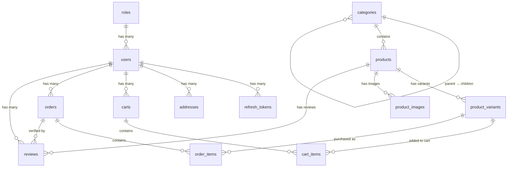

# DATABASE.md — Ecommerce Shop

## 1. Overview

- **Database:** SQL Server
- **ORM:** TypeORM (NestJS integration)
- **Naming conventions:**
  - Tables & columns: `snake_case`
  - Indexes: `idx_{table}_{column}`
- **Unicode:** All string columns use `NVARCHAR` (Vietnamese product names, addresses)
- **Timestamps:** `DATETIME2` with `SYSUTCDATETIME()` default — store UTC, convert in app layer
- **Money:** `DECIMAL(10,2)` — never use `FLOAT`
- **Booleans:** `BIT` (`1`/`0`)

---

## 2. Entities by Feature

### 2.1 Auth Feature

#### `roles`

| Field | Type | Constraints |
|-------|------|-------------|
| id | INT | PK, auto-increment |
| name | NVARCHAR(50) | NOT NULL, UNIQUE — `customer`, `admin` (extensible: `seller`, `moderator`) |

#### `users`

| Field | Type | Constraints |
|-------|------|-------------|
| id | INT | PK, auto-increment |
| role_id | INT | FK → `roles.id`, NOT NULL |
| email | NVARCHAR(255) | NOT NULL, UNIQUE |
| password_hash | NVARCHAR(255) | NOT NULL — bcrypt hash, **never** store plain text |
| full_name | NVARCHAR(100) | NOT NULL |
| phone | NVARCHAR(20) | NULL |
| is_active | BIT | NOT NULL, DEFAULT `1` — soft ban without deleting data |
| created_at | DATETIME2 | NOT NULL, DEFAULT `SYSUTCDATETIME()` |
| updated_at | DATETIME2 | NOT NULL, DEFAULT `SYSUTCDATETIME()` |

> **Shared entity** — referenced by Order, Review, Cart, and User Profile features.

#### `refresh_tokens`

| Field | Type | Constraints |
|-------|------|-------------|
| id | INT | PK, auto-increment |
| user_id | INT | FK → `users.id`, NOT NULL |
| token_hash | NVARCHAR(255) | NOT NULL — hashed, **never** store plain |
| expires_at | DATETIME2 | NOT NULL |
| created_at | DATETIME2 | NOT NULL, DEFAULT `SYSUTCDATETIME()` |
| is_revoked | BIT | NOT NULL, DEFAULT `0` — soft revoke on logout/password change |
| ip_address | NVARCHAR(45) | NULL — supports IPv4/IPv6 |
| user_agent | NVARCHAR(500) | NULL |
| device_name | NVARCHAR(100) | NULL — e.g. "Chrome on Windows" |

**Indexes:**

| Index | Column(s) | Purpose |
|-------|-----------|---------|
| `idx_refresh_tokens_token_hash` | token_hash | Fast token lookup on every authenticated request |
| `idx_refresh_tokens_user_id` | user_id | Find all tokens for a user (logout all devices) |
| `idx_refresh_tokens_expires_at` | expires_at | Scheduled cleanup of expired tokens |

> **Multi-device support:** One user → many tokens. Soft revoke via `is_revoked` instead of hard delete for audit trail.

---

### 2.2 User Profile Feature

#### `addresses`

| Field | Type | Constraints |
|-------|------|-------------|
| id | INT | PK, auto-increment |
| user_id | INT | FK → `users.id`, NOT NULL |
| full_name | NVARCHAR(100) | NOT NULL — recipient name, can differ from account name |
| phone | NVARCHAR(20) | NOT NULL |
| address_line | NVARCHAR(255) | NOT NULL — street number, street name |
| city | NVARCHAR(100) | NOT NULL |
| is_default | BIT | NOT NULL, DEFAULT `0` — marks default address for checkout |

---

### 2.3 Product Catalog Feature

#### `categories`

| Field | Type | Constraints |
|-------|------|-------------|
| id | INT | PK, auto-increment |
| parent_id | INT | FK → `categories.id`, NULL — self-referencing for N-level hierarchy |
| name | NVARCHAR(100) | NOT NULL |
| slug | NVARCHAR(100) | NOT NULL, UNIQUE — SEO-friendly URL |

> **Self-referencing hierarchy:** `parent_id = NULL` means root category. Example: Fashion → Shirts → T-shirts.

#### `products`

| Field | Type | Constraints |
|-------|------|-------------|
| id | INT | PK, auto-increment |
| category_id | INT | FK → `categories.id`, NOT NULL |
| name | NVARCHAR(255) | NOT NULL |
| slug | NVARCHAR(255) | NOT NULL, UNIQUE — SEO-friendly URL |
| description | NVARCHAR(MAX) | NULL |
| thumbnail_url | NVARCHAR(500) | NULL — main display image |
| is_active | BIT | NOT NULL, DEFAULT `1` — hide instead of hard delete |
| created_at | DATETIME2 | NOT NULL, DEFAULT `SYSUTCDATETIME()` |
| updated_at | DATETIME2 | NOT NULL, DEFAULT `SYSUTCDATETIME()` |

#### `product_variants` ⚠️ Transaction Hub

| Field | Type | Constraints |
|-------|------|-------------|
| id | INT | PK, auto-increment |
| product_id | INT | FK → `products.id`, NOT NULL |
| sku | NVARCHAR(50) | NOT NULL, UNIQUE — unique identifier per variant |
| color | NVARCHAR(50) | NULL |
| size | NVARCHAR(50) | NULL |
| price | DECIMAL(10,2) | NOT NULL — original price |
| sale_price | DECIMAL(10,2) | NULL — promotional price |
| stock_quantity | INT | NOT NULL, DEFAULT `0` |

> **Critical design decision:** `cart_items` and `order_items` FK to `product_variants`, **NOT** to `products`. Each combination of color + size = 1 separate variant row.

#### `product_images`

| Field | Type | Constraints |
|-------|------|-------------|
| id | INT | PK, auto-increment |
| product_id | INT | FK → `products.id`, NOT NULL |
| image_url | NVARCHAR(500) | NOT NULL |
| sort_order | INT | NOT NULL, DEFAULT `0` — display order |

---

### 2.4 Cart Feature

#### `carts`

| Field | Type | Constraints |
|-------|------|-------------|
| id | INT | PK, auto-increment |
| user_id | INT | FK → `users.id`, NULL — **nullable** for guest cart support |
| session_id | NVARCHAR(100) | NULL — identifies guest cart before login |
| created_at | DATETIME2 | NOT NULL, DEFAULT `SYSUTCDATETIME()` |

> **Guest cart flow:** Guest browses → `user_id = NULL`, `session_id = 'abc123'` → User logs in → merge guest cart into user cart → set `user_id`, clear `session_id`.

#### `cart_items`

| Field | Type | Constraints |
|-------|------|-------------|
| id | INT | PK, auto-increment |
| cart_id | INT | FK → `carts.id`, NOT NULL |
| product_variant_id | INT | FK → `product_variants.id`, NOT NULL |
| quantity | INT | NOT NULL, CHECK (`quantity > 0`) |

---

### 2.5 Order Feature

#### `orders`

| Field | Type | Constraints |
|-------|------|-------------|
| id | INT | PK, auto-increment |
| user_id | INT | FK → `users.id`, NOT NULL |
| status | NVARCHAR(20) | NOT NULL, DEFAULT `'pending'` — `pending` / `confirmed` / `shipping` / `delivered` / `cancelled` |
| payment_method | NVARCHAR(20) | NOT NULL — `cod` / `banking` / `momo` |
| payment_status | NVARCHAR(20) | NOT NULL, DEFAULT `'unpaid'` — `unpaid` / `paid` |
| shipping_fee | DECIMAL(10,2) | NOT NULL, DEFAULT `0` |
| total_amount | DECIMAL(10,2) | NOT NULL |
| shipping_address | NVARCHAR(MAX) | NOT NULL — **JSON snapshot**, NOT FK to addresses |
| created_at | DATETIME2 | NOT NULL, DEFAULT `SYSUTCDATETIME()` |

> **Key decisions:**
> - `shipping_address` is a JSON snapshot — preserves the address at order time even if the user edits/deletes their address later.
> - `payment_status` is independent from `status` — a paid order can still be cancelled (triggers refund flow).
> - Enums stored as string columns for readability and easy migration.

#### `order_items` — Immutable Snapshots

| Field | Type | Constraints |
|-------|------|-------------|
| id | INT | PK, auto-increment |
| order_id | INT | FK → `orders.id`, NOT NULL |
| product_variant_id | INT | FK → `product_variants.id`, NULL — kept for navigation; NULL if variant deleted |
| product_name | NVARCHAR(255) | NOT NULL — **snapshot** |
| sku | NVARCHAR(50) | NOT NULL — **snapshot** |
| price | DECIMAL(10,2) | NOT NULL — **snapshot** |
| quantity | INT | NOT NULL, CHECK (`quantity > 0`) |
| thumbnail_url | NVARCHAR(500) | NULL — **snapshot** |

> All snapshot fields are copied at purchase time — immune to future product edits/deletions.

---

### 2.6 Review Feature

#### `reviews` — 3-Way Link

| Field | Type | Constraints |
|-------|------|-------------|
| id | INT | PK, auto-increment |
| user_id | INT | FK → `users.id`, NOT NULL |
| product_id | INT | FK → `products.id`, NOT NULL |
| order_id | INT | FK → `orders.id`, NOT NULL |
| rating | INT | NOT NULL, CHECK (`rating >= 1 AND rating <= 5`) |
| comment | NVARCHAR(MAX) | NULL |
| created_at | DATETIME2 | NOT NULL, DEFAULT `SYSUTCDATETIME()` |

> **Purchase verification:** The 3-way FK (users × products × orders) ensures only users who actually purchased a product can review it. The `order_id` link proves the purchase.

---

## 3. Entity Relationship Diagram



**Key relationships to note:**
- **`product_variants`** is the transaction hub — both `cart_items` and `order_items` FK here, not to `products`
- **`reviews`** has a 3-way link: `user_id` + `product_id` + `order_id`
- **`categories`** self-references via `parent_id` for N-level nesting

---

## 4. Conventions

| Convention | Implementation |
|------------|----------------|
| Primary keys | Auto-increment `INT` |
| Soft delete | `is_active` (BIT) on `users`, `products` |
| Soft revoke | `is_revoked` (BIT) on `refresh_tokens` |
| Timestamps | `created_at`, `updated_at` — `DATETIME2` |
| Enums | String columns: `orders.status`, `payment_method`, `payment_status` |
| SEO slugs | `slug` (UNIQUE) on `categories`, `products` |
| Unicode | `NVARCHAR` everywhere — Vietnamese names, addresses |
| Money | `DECIMAL(10,2)` — never `FLOAT` or `MONEY` |
| JSON columns | `NVARCHAR(MAX)` — `orders.shipping_address` |
| Index naming | `idx_{table}_{column}` |

---

## 5. TypeORM Patterns

### Entity Decorator Example

```typescript
// src/features/product-catalog/entities/product-variant.entity.ts
@Entity('product_variants')
export class ProductVariant {
  @PrimaryGeneratedColumn()
  id: number;

  @Column({ type: 'nvarchar', length: 50, unique: true })
  sku: string;

  @Column({ type: 'decimal', precision: 10, scale: 2 })
  price: number;

  @Column({ type: 'decimal', precision: 10, scale: 2, nullable: true })
  sale_price: number;

  @Column({ type: 'int', default: 0 })
  stock_quantity: number;

  @ManyToOne(() => Product, (product) => product.variants)
  @JoinColumn({ name: 'product_id' })
  product: Product;

  @OneToMany(() => CartItem, (cartItem) => cartItem.product_variant)
  cart_items: CartItem[];

  @OneToMany(() => OrderItem, (orderItem) => orderItem.product_variant)
  order_items: OrderItem[];
}
```

### Relation Loading Strategy

| Feature | Relation | Strategy | Reason |
|---------|----------|----------|--------|
| Product Catalog | `product.variants` | Eager | Always needed when displaying products |
| Product Catalog | `product.images` | Eager | Always shown in product detail |
| Cart | `cartItem.product_variant` | Eager | Need variant info for cart display |
| Order | `order.order_items` | Lazy | Only load when viewing order detail |
| Review | `review.user` | Lazy | Load only when rendering review list |
| Auth | `user.refresh_tokens` | Lazy | Rarely needed, only on token validation |

---

## 6. Migration Rules

### Migration Order (FK-safe)

```
1. roles
2. users
3. refresh_tokens
4. addresses
5. categories
6. products
7. product_variants + product_images  (parallel — both FK to products)
8. carts
9. cart_items
10. orders
11. order_items
12. reviews  (last — FKs to users, products, orders)
```

### Commands

```bash
# Generate a new migration after entity changes
npx typeorm migration:generate src/database/migrations/MigrationName -d src/database/data-source.ts

# Run pending migrations
npx typeorm migration:run -d src/database/data-source.ts

# Revert last migration
npx typeorm migration:revert -d src/database/data-source.ts
```

### Migration Naming

Format: `{timestamp}-{DescriptiveName}.ts`

Examples:
- `1700000000000-CreateRolesAndUsersTable.ts`
- `1700000001000-CreateProductCatalogTables.ts`
- `1700000002000-AddIndexesToRefreshTokens.ts`

### Rollback Policy

- Every migration **must** have a working `down()` method
- Test rollback locally before pushing to `main`
- Production rollbacks require team lead approval
- Data migrations (seed/backfill) go in separate migration files from schema changes

---

## 7. Indexing Strategy

High-read tables get explicit indexes beyond PKs and unique constraints:

| Table | Index | Column(s) | Use Case |
|-------|-------|-----------|----------|
| refresh_tokens | `idx_refresh_tokens_token_hash` | token_hash | Token lookup on every request |
| refresh_tokens | `idx_refresh_tokens_user_id` | user_id | Logout all devices |
| refresh_tokens | `idx_refresh_tokens_expires_at` | expires_at | Scheduled cleanup job |
| product_variants | `idx_product_variants_product_id` | product_id | Load variants for a product |
| product_variants | `idx_product_variants_sku` | sku | Already covered by UNIQUE |
| orders | `idx_orders_user_id` | user_id | User's order history |
| reviews | `idx_reviews_product_id` | product_id | Product review listing |
| cart_items | `idx_cart_items_cart_id` | cart_id | Load cart contents |