# DATABASE.md — Ecommerce Shop

## 1. Overview

- **Database:** SQL Server
- **ORM:** TypeORM (NestJS integration)
- **Naming conventions:**
  - Tables & columns: `snake_case`
  - Indexes: `idx_{table}_{column}`
- **Unicode:** All string columns use `NVARCHAR` (Vietnamese product names, addresses)
- **Timestamps:** `DATETIME2` with `SYSUTCDATETIME()` default — store UTC, convert in app layer
- **Money:** `DECIMAL(10,2)` — never use `FLOAT`
- **Booleans:** `BIT` (`1`/`0`)

---

## 2. Entities by Feature

### 2.1 Auth Feature

#### `roles`

| Field | Type | Constraints |
|-------|------|-------------|
| id | INT | PK, auto-increment |
| name | NVARCHAR(50) | NOT NULL, UNIQUE — `customer`, `admin`, `seller`, `shipper` |
| is_system | BIT | NOT NULL, DEFAULT `0` — system roles cannot be deleted |

#### `permissions`

| Field | Type | Constraints |
|-------|------|-------------|
| id | INT | PK, auto-increment |
| name | NVARCHAR(100) | NOT NULL — human-readable label (e.g. "Create Product") |
| resource | NVARCHAR(50) | NOT NULL — resource key (e.g. `products`, `orders`, `dashboard`) |
| action | NVARCHAR(50) | NOT NULL — action key (e.g. `create`, `read`, `update`, `delete`) |
| description | NVARCHAR(255) | NULL |
| created_at | DATETIME2 | NOT NULL, DEFAULT `SYSUTCDATETIME()` |
| updated_at | DATETIME2 | NOT NULL, DEFAULT `SYSUTCDATETIME()` |

**Constraints:** UNIQUE `(resource, action)` — `uq_permissions_resource_action`

> **Dynamic RBAC:** Permissions are stored as `resource:action` strings (e.g. `products:create`). Admin endpoints use `@Permissions(PERMISSIONS.PRODUCTS_CREATE)` decorator instead of role-based `@Roles()`. Permission strings are defined in `common/constants/permissions.constant.ts`.

#### `role_permissions` — Junction

| Field | Type | Constraints |
|-------|------|-------------|
| id | INT | PK, auto-increment |
| role_id | INT | FK → `roles.id`, NOT NULL, CASCADE delete |
| permission_id | INT | FK → `permissions.id`, NOT NULL, CASCADE delete |

**Constraints:** UNIQUE `(role_id, permission_id)` — `uq_role_permissions_role_permission`

> **Role-permission mapping:** Admin role gets all permissions. Seller gets products CRUD + categories read + orders read + uploads + dashboard. Shipper gets orders read/update + dashboard. Customer has no admin permissions (all customer actions are handled by JWT auth, not permission checks).

#### `users`

| Field | Type | Constraints |
|-------|------|-------------|
| id | INT | PK, auto-increment |
| role_id | INT | FK → `roles.id`, NOT NULL |
| email | NVARCHAR(255) | NOT NULL, UNIQUE |
| password_hash | NVARCHAR(255) | NULL — bcrypt hash, **never** store plain text. NULL for OAuth-only users |
| full_name | NVARCHAR(100) | NOT NULL |
| phone | NVARCHAR(20) | NULL |
| email_verified | BIT | NOT NULL, DEFAULT `0` — must verify email before login |
| email_verify_token | NVARCHAR(255) | NULL — SHA-256 hash of 6-digit OTP |
| email_verify_expires | DATETIME2 | NULL — OTP expiry (5 minutes) |
| email_verify_count | INT | NOT NULL, DEFAULT `0` — resend counter (max 5/hour) |
| email_verify_count_reset | DATETIME2 | NULL — resets counter each hour |
| email_verify_attempts | INT | NOT NULL, DEFAULT `0` — failed verify attempts (max 5 before new OTP required) |
| password_reset_token_hash | NVARCHAR(255) | NULL — SHA-256 hash of reset token |
| password_reset_expires_at | DATETIME2 | NULL — reset token expiry (1 hour) |
| is_active | BIT | NOT NULL, DEFAULT `1` — soft ban without deleting data |
| created_at | DATETIME2 | NOT NULL, DEFAULT `SYSUTCDATETIME()` |
| updated_at | DATETIME2 | NOT NULL, DEFAULT `SYSUTCDATETIME()` |

> **Shared entity** — referenced by Order, Review, Cart, and User Profile features.
> **OAuth users** have `password_hash = NULL` — they authenticate via `user_auth_providers` instead. Use `POST /auth/set-password` to add a local password.
> **Email verification** blocks login until `email_verified = true`. OTP sent via email on registration.

#### `refresh_tokens`

| Field | Type | Constraints |
|-------|------|-------------|
| id | INT | PK, auto-increment |
| user_id | INT | FK → `users.id`, NOT NULL |
| token_hash | NVARCHAR(255) | NOT NULL — hashed, **never** store plain |
| expires_at | DATETIME2 | NOT NULL |
| created_at | DATETIME2 | NOT NULL, DEFAULT `SYSUTCDATETIME()` |
| is_revoked | BIT | NOT NULL, DEFAULT `0` — soft revoke on logout/password change |
| ip_address | NVARCHAR(45) | NULL — supports IPv4/IPv6 |
| user_agent | NVARCHAR(500) | NULL |
| device_name | NVARCHAR(100) | NULL — e.g. "Chrome on Windows" |

> **Multi-device support:** One user → many tokens. Soft revoke via `is_revoked` instead of hard delete for audit trail.

#### `user_auth_providers` — OAuth Multi-Provider

| Field | Type | Constraints |
|-------|------|-------------|
| id | INT | PK, auto-increment |
| user_id | INT | FK → `users.id`, NOT NULL, CASCADE delete |
| provider | NVARCHAR(20) | NOT NULL — `'google'`, `'facebook'` |
| provider_id | NVARCHAR(255) | NOT NULL — ID from OAuth provider |
| created_at | DATETIME2 | NOT NULL, DEFAULT `SYSUTCDATETIME()` |

**Constraints:**
- UNIQUE `(provider, provider_id)` — `uq_user_auth_providers_provider_provider_id` — one OAuth identity maps to one user
- UNIQUE `(user_id, provider)` — `uq_user_auth_providers_user_provider` — one user per provider (can't link two Google accounts)

> **Multi-provider design:** Replaces single `provider`/`provider_id` columns on `users`. Each user can link multiple OAuth providers (e.g. both Google and Facebook). When an OAuth login matches an existing user by email, a new `user_auth_providers` record is created (account linking). Users with `password_hash = NULL` are OAuth-only; they can add a local password via `POST /auth/set-password`.

#### `oauth_codes` — One-Time Authorization Codes

| Field | Type | Constraints |
|-------|------|-------------|
| id | INT | PK, auto-increment |
| code_hash | NVARCHAR(255) | NOT NULL — SHA-256 hash of one-time code |
| user_id | INT | FK → `users.id`, NOT NULL |
| expires_at | DATETIME2 | NOT NULL — TTL 60 seconds |
| created_at | DATETIME2 | NOT NULL, DEFAULT `SYSUTCDATETIME()` |

> **Security flow:** OAuth callback generates a one-time code → stores SHA-256 hash in `oauth_codes` → redirects to frontend with raw code → frontend exchanges code for JWT tokens via `POST /auth/oauth/exchange` → backend deletes the code record before returning tokens (atomic find+delete prevents replay). Cleanup cron deletes expired codes every 10 minutes.

---

### 2.2 User Profile Feature

#### `addresses`

| Field | Type | Constraints |
|-------|------|-------------|
| id | INT | PK, auto-increment |
| user_id | INT | FK → `users.id`, NOT NULL |
| full_name | NVARCHAR(100) | NOT NULL — recipient name, can differ from account name |
| phone | NVARCHAR(20) | NOT NULL |
| address_line | NVARCHAR(255) | NOT NULL — street number, street name |
| city | NVARCHAR(100) | NOT NULL |
| is_default | BIT | NOT NULL, DEFAULT `0` — marks default address for checkout |

---

### 2.3 Shop Feature

#### `shops`

| Field | Type | Constraints |
|-------|------|-------------|
| id | INT | PK, auto-increment |
| user_id | INT | FK → `users.id`, NOT NULL, UNIQUE — 1:1 relationship |
| name | NVARCHAR(100) | NOT NULL |
| slug | NVARCHAR(100) | NOT NULL, UNIQUE — SEO-friendly URL, immutable after creation |
| description | NVARCHAR(MAX) | NULL |
| logo_url | NVARCHAR(500) | NULL |
| banner_url | NVARCHAR(500) | NULL |
| decoration_config | NVARCHAR(MAX) | NULL — **JSON** storefront decoration (Shop Decoration block builder); NULL = default layout |
| status | NVARCHAR(30) | NOT NULL, DEFAULT `'pending_verification'`, CHECK IN (`pending_verification`, `active`, `suspended`, `banned`) |
| verified_at | DATETIME2 | NULL — set when admin approves (preserved permanently) |
| verified_by | INT | FK → `users.id` ON DELETE SET NULL, NULL — admin who approved |
| suspended_at | DATETIME2 | NULL — set on latest suspension |
| banned_at | DATETIME2 | NULL — set on ban |
| created_at | DATETIME2 | NOT NULL, DEFAULT `SYSUTCDATETIME()` |
| updated_at | DATETIME2 | NOT NULL, DEFAULT `SYSUTCDATETIME()` |

> **1:1 with users:** Each seller has exactly one shop. UNIQUE constraint on `user_id` enforces this. Race condition on concurrent POST handled by catching SQL Server error 2627/2601 → mapped to SHOP_002.
> **Status lifecycle:** `pending_verification` → `active` → `suspended`/`banned`. `verified_at`/`verified_by` are set once on first approval and preserved permanently. `suspended_at`/`banned_at` are overwritten on each state change.
> **Public visibility:** Products from shops with `status != 'active'` are hidden from the public storefront. All public product queries join shops and filter `shops.status = 'active'`.
> **Shop Decoration (`decoration_config`):** A versioned JSON envelope `{ version: 1, theme?: { accent? }, blocks: [{ id, type, data }] }` describing the seller's customized storefront (block-based page builder). Stored as a raw `NVARCHAR(MAX)` string (repo JSON convention — manual `JSON.stringify`/`JSON.parse` in the service, like `orders.shipping_address` / `ai_messages.actions`), not a TypeORM transformer. Block types: `hero` / `rich_text` / `image` / `product_grid` (extensible — a `video` block can be added later without a schema/column change). Validated at write via nested class-validator DTOs (≤20 blocks, hero 1–5 images, grid 1–12 product ids, serialized ≤16 KB → `SHOP_006`); parsed defensively on read (malformed → `null`). NULL = default layout, so existing shops are unaffected. Added by migration `1756900000000-AddDecorationConfigToShops` (dev auto-adds via `synchronize`).

---

### 2.4 Product Catalog Feature

#### `categories`

| Field | Type | Constraints |
|-------|------|-------------|
| id | INT | PK, auto-increment |
| parent_id | INT | FK → `categories.id`, NULL — self-referencing for N-level hierarchy |
| name | NVARCHAR(100) | NOT NULL |
| slug | NVARCHAR(100) | NOT NULL, UNIQUE — SEO-friendly URL |

> **Self-referencing hierarchy:** `parent_id = NULL` means root category. Example: Fashion → Shirts → T-shirts.

#### `products`

| Field | Type | Constraints |
|-------|------|-------------|
| id | INT | PK, auto-increment |
| category_id | INT | FK → `categories.id`, NOT NULL |
| shop_id | INT | FK → `shops.id`, NULL — links product to seller's shop |
| name | NVARCHAR(255) | NOT NULL |
| slug | NVARCHAR(255) | NOT NULL, UNIQUE — SEO-friendly URL |
| description | NVARCHAR(MAX) | NULL |
| thumbnail_url | NVARCHAR(500) | NULL — main display image |
| option1_label | NVARCHAR(50) | NULL — label for variant axis 1 (e.g. "Màu sắc", "Color") |
| option2_label | NVARCHAR(50) | NULL — label for variant axis 2 (e.g. "Kích thước", "Size") |
| is_active | BIT | NOT NULL, DEFAULT `1` — hide instead of hard delete |
| created_at | DATETIME2 | NOT NULL, DEFAULT `SYSUTCDATETIME()` |
| updated_at | DATETIME2 | NOT NULL, DEFAULT `SYSUTCDATETIME()` |

> **Flexible variant axes:** Products define their own option labels. A clothing product might use "Color" + "Size", while a phone uses "Storage" + "Color". Labels are snapshotted into `order_items.variant_option*_label` at checkout.

#### `product_variants` ⚠️ Transaction Hub

| Field | Type | Constraints |
|-------|------|-------------|
| id | INT | PK, auto-increment |
| product_id | INT | FK → `products.id`, NOT NULL |
| sku | NVARCHAR(50) | NOT NULL, UNIQUE — unique identifier per variant |
| option1 | NVARCHAR(50) | NULL — value for axis 1 (e.g. "Đen", "Black") |
| option2 | NVARCHAR(50) | NULL — value for axis 2 (e.g. "L", "128GB") |
| price | DECIMAL(10,2) | NOT NULL — original price |
| sale_price | DECIMAL(10,2) | NULL — promotional price |
| stock_quantity | INT | NOT NULL, DEFAULT `0` |

> **Critical design decision:** `cart_items` and `order_items` FK to `product_variants`, **NOT** to `products`. Each combination of option1 + option2 = 1 separate variant row. Columns are generic (`option1`/`option2`) instead of domain-specific (`color`/`size`) to support any product type.

#### `product_images`

| Field | Type | Constraints |
|-------|------|-------------|
| id | INT | PK, auto-increment |
| product_id | INT | FK → `products.id`, NOT NULL |
| image_url | NVARCHAR(500) | NOT NULL |
| sort_order | INT | NOT NULL, DEFAULT `0` — display order |

---

### 2.5 Cart Feature

#### `carts`

| Field | Type | Constraints |
|-------|------|-------------|
| id | INT | PK, auto-increment |
| user_id | INT | FK → `users.id`, NULL — **nullable** for guest cart support |
| session_id | NVARCHAR(100) | NULL — identifies guest cart before login |
| created_at | DATETIME2 | NOT NULL, DEFAULT `SYSUTCDATETIME()` |

> **Guest cart flow:** Guest browses → `user_id = NULL`, `session_id = 'abc123'` → User logs in → merge guest cart into user cart → set `user_id`, clear `session_id`.

#### `cart_items`

| Field | Type | Constraints |
|-------|------|-------------|
| id | INT | PK, auto-increment |
| cart_id | INT | FK → `carts.id`, NOT NULL |
| product_variant_id | INT | FK → `product_variants.id`, NOT NULL |
| quantity | INT | NOT NULL, CHECK (`quantity > 0`) |

---

### 2.6 Order Feature

#### `orders`

| Field | Type | Constraints |
|-------|------|-------------|
| id | INT | PK, auto-increment |
| user_id | INT | FK → `users.id`, NOT NULL |
| shop_id | INT | FK → `shops.id`, NOT NULL — each order belongs to exactly one shop |
| shop_name | NVARCHAR(100) | NOT NULL — **snapshot** of shop name at order time (immutable) |
| order_group_id | NVARCHAR(36) | NOT NULL — UUID linking orders from the same checkout |
| status | NVARCHAR(20) | NOT NULL, DEFAULT `'pending'` — `pending` / `confirmed` / `shipping` / `delivered` / `completed` / `return_requested` / `cancelled` |
| payment_method | NVARCHAR(20) | NOT NULL — `cod` / `vnpay` / `momo` |
| payment_status | NVARCHAR(20) | NOT NULL, DEFAULT `'unpaid'` — `unpaid` / `paid` |
| shipping_fee | DECIMAL(10,2) | NOT NULL, DEFAULT `0` |
| total_amount | DECIMAL(10,2) | NOT NULL |
| shipping_address | NVARCHAR(MAX) | NOT NULL — **JSON snapshot**, NOT FK to addresses |
| coupon_code | NVARCHAR(50) | NULL — **snapshot** of applied coupon code |
| discount_amount | DECIMAL(10,2) | NOT NULL, DEFAULT `0` |
| coin_discount | DECIMAL(10,2) | NOT NULL, DEFAULT `0` — **snapshot** of Xu (Hoàn Xu) redeemed against this sub-order (Module 23) |
| shipper_id | INT | FK → `users.id` ON DELETE SET NULL, NULL — assigned shipper for delivery |
| delivered_at | DATETIME2 | NULL — set when order transitions to `delivered`, used by auto-complete cron |
| created_at | DATETIME2 | NOT NULL, DEFAULT `SYSUTCDATETIME()` |

> **Key decisions:**
> - **Multi-shop order splitting:** 1 checkout → N orders (1 per shop), linked by `order_group_id` (UUID v4). Each order has `shop_id` + `shop_name` denormalized directly, avoiding joins through `order_items` for seller queries.
> - `shop_name` is an immutable snapshot — not updated when shop changes name.
> - `shipping_address` is a JSON snapshot — preserves the address at order time even if the user edits/deletes their address later.
> - `payment_status` is independent from `status` — a paid order can still be cancelled (triggers refund flow).
> - `coupon_code` and `discount_amount` are snapshots — immune to coupon edits/deletions after checkout. Discount is proportionally distributed across sub-orders: `shopDiscount = (shopItemsTotal / totalItemsAmount) × discountAmount`.
> - **Formula:** `total_amount = shopItemsTotal - discount_amount - coin_discount + shipping_fee` (per sub-order). `coin_discount` (Module 23) is the Xu redeemed on this sub-order, distributed by headroom; reversed as a fresh Xu batch on cancel.
> - Enums stored as string columns for readability and easy migration.
> - **Order completion flow:** `delivered` is no longer terminal. Customer can confirm receipt (`completed`) or request return (`return_requested`). Orders auto-complete 7 days after `delivered_at` via hourly cron. Revenue (dashboard) and review eligibility require `completed` status.
> - **`delivered_at`** is set when order transitions to `delivered` (admin, seller, or shipper). Used by auto-complete cron to find orders past the 7-day window.
> - **`shipper_id`** is assigned when a shipper accepts the order (first-come-first-served). Atomic conditional UPDATE prevents race conditions. `ON DELETE SET NULL` preserves order history if shipper account is deleted.
> - **Coupon reversal:** Only reversed when ALL orders in the same `order_group_id` are cancelled — cancelling one sub-order does not reverse the coupon.

#### `order_items` — Immutable Snapshots

| Field | Type | Constraints |
|-------|------|-------------|
| id | INT | PK, auto-increment |
| order_id | INT | FK → `orders.id`, NOT NULL |
| product_variant_id | INT | FK → `product_variants.id`, NULL — kept for navigation; NULL if variant deleted |
| shop_id | INT | NULL — **snapshot** of shop at purchase time |
| shop_name | NVARCHAR(100) | NULL — **snapshot** of shop name at purchase time |
| product_name | NVARCHAR(255) | NOT NULL — **snapshot** |
| sku | NVARCHAR(50) | NOT NULL — **snapshot** |
| price | DECIMAL(10,2) | NOT NULL — **snapshot** |
| quantity | INT | NOT NULL, CHECK (`quantity > 0`) |
| thumbnail_url | NVARCHAR(500) | NULL — **snapshot** |
| variant_option1_label | NVARCHAR(50) | NULL — **snapshot** of `products.option1_label` (e.g. "Màu sắc") |
| variant_option1_value | NVARCHAR(50) | NULL — **snapshot** of `product_variants.option1` (e.g. "Đen") |
| variant_option2_label | NVARCHAR(50) | NULL — **snapshot** of `products.option2_label` (e.g. "Kích thước") |
| variant_option2_value | NVARCHAR(50) | NULL — **snapshot** of `product_variants.option2` (e.g. "L") |

> All snapshot fields are copied at purchase time — immune to future product edits/deletions. The `variant_option*` fields preserve the variant attributes (label from product, value from variant) so order history displays correctly even if the product is later modified. `shop_id` and `shop_name` are nullable — historical order_items from before the shop feature may have NULL values.

---

### 2.7 Review Feature

#### `reviews` — 3-Way Link

| Field | Type | Constraints |
|-------|------|-------------|
| id | INT | PK, auto-increment |
| user_id | INT | FK → `users.id`, NOT NULL |
| product_id | INT | FK → `products.id`, NOT NULL |
| order_id | INT | FK → `orders.id`, NOT NULL |
| rating | INT | NOT NULL, CHECK (`rating >= 1 AND rating <= 5`) |
| comment | NVARCHAR(MAX) | NULL |
| created_at | DATETIME2 | NOT NULL, DEFAULT `SYSUTCDATETIME()` |

> **Purchase verification:** The 3-way FK (users × products × orders) ensures only users who actually purchased a product can review it. The `order_id` link proves the purchase.

---

### 2.8 Wishlist Feature

#### `wishlist_items`

| Field | Type | Constraints |
|-------|------|-------------|
| id | INT | PK, auto-increment |
| user_id | INT | FK → `users.id`, NOT NULL |
| product_id | INT | FK → `products.id`, NOT NULL |
| created_at | DATETIME2 | NOT NULL, DEFAULT `SYSUTCDATETIME()` |

**Constraints:** UNIQUE `(user_id, product_id)` — `uq_wishlist_items_user_product`

> **Design decision:** Wishlist links to `products`, NOT `product_variants`. Follows the Amazon model — user saves a product, selects variant when adding to cart. Consistent with `reviews` (also FK to `product_id`).

---

### 2.9 Coupon Feature

#### `coupons`

| Field | Type | Constraints |
|-------|------|-------------|
| id | INT | PK, auto-increment |
| code | NVARCHAR(50) | NOT NULL, UNIQUE — stored uppercase |
| shop_id | INT | FK → `shops.id` ON DELETE NO ACTION, NULL — `NULL` = platform coupon (admin); NOT NULL = shop coupon (seller-owned) |
| description | NVARCHAR(255) | NULL — internal description for admin |
| discount_type | NVARCHAR(20) | NOT NULL — `'fixed'` / `'percentage'` |
| discount_value | DECIMAL(10,2) | NOT NULL — VND if fixed, % (0-100) if percentage |
| scope | NVARCHAR(20) | NOT NULL, DEFAULT `'all'` — `'all'` / `'categories'` / `'products'` |
| min_order_amount | DECIMAL(10,2) | NULL — minimum applicable items total |
| max_discount_amount | DECIMAL(10,2) | NULL — cap for percentage discount |
| max_uses | INT | NULL — global usage limit (NULL = unlimited) |
| max_uses_per_user | INT | NOT NULL, DEFAULT `1` |
| current_uses | INT | NOT NULL, DEFAULT `0` |
| starts_at | DATETIME2 | NOT NULL |
| expires_at | DATETIME2 | NOT NULL |
| is_active | BIT | NOT NULL, DEFAULT `1` — soft deactivate |
| admin_disabled | BIT | NOT NULL, DEFAULT `0` — sticky admin moderation lock (shop coupons); seller cannot re-enable |
| created_at | DATETIME2 | NOT NULL, DEFAULT `SYSUTCDATETIME()` |
| updated_at | DATETIME2 | NOT NULL, DEFAULT `SYSUTCDATETIME()` |

> **Scope design:** `scope = 'all'` applies to entire order. `scope = 'categories'` uses `coupon_categories` junction table (includes sub-categories via recursive `parent_id` traversal). `scope = 'products'` uses `coupon_products` junction table. `min_order_amount` checks against applicable items total only, not entire cart.
>
> **Shop coupons (`shop_id` NOT NULL):** Created/managed by sellers via `/seller/coupons`, owned by one shop, and only discount that shop's items in a multi-shop cart. Seller scope is limited to `all` (whole shop) or `products` (specific products of that shop) — never `categories`. The stored `code` is prefixed with the shop slug (e.g. `MY-SHOP-SALE10`) but remains globally UNIQUE. Only valid while the owning shop is `active` (otherwise treated as inactive → `COUPON_006`). Admin can view and deactivate shop coupons but cannot edit their content or create them. Index `idx_coupons_shop_id`.
>
> **Admin lock (`admin_disabled`):** When an admin deactivates a shop coupon, `admin_disabled` is set to `1` (sticky) alongside `is_active = false`. A locked coupon validates as inactive (`COUPON_006`) and the owning seller cannot edit or re-enable it (`COUPON_013`). Only an admin can clear the lock (`PATCH /admin/coupons/:id/unlock`, which sets `admin_disabled = 0` **only** — it does not touch `is_active`; the owning seller re-enables the coupon afterward). Platform coupons never set this flag.
>
> **Multi-coupon checkout:** A cart may apply ≤1 platform coupon + ≤1 coupon per shop (`coupon_usages` records one row per coupon per sub-order it discounts). A shop coupon's discount stays on its own sub-order; a platform coupon's discount is split across shops by applicable subtotal and fills only the headroom left after any shop coupon.

#### `coupon_categories` — Junction

| Field | Type | Constraints |
|-------|------|-------------|
| id | INT | PK, auto-increment |
| coupon_id | INT | FK → `coupons.id`, NOT NULL, CASCADE delete |
| category_id | INT | FK → `categories.id`, NOT NULL |

**Constraint:** UNIQUE `(coupon_id, category_id)`

> Only populated when `coupons.scope = 'categories'`. Coupon applies to all products in specified categories and their sub-categories.

#### `coupon_products` — Junction

| Field | Type | Constraints |
|-------|------|-------------|
| id | INT | PK, auto-increment |
| coupon_id | INT | FK → `coupons.id`, NOT NULL, CASCADE delete |
| product_id | INT | FK → `products.id`, NOT NULL |

**Constraint:** UNIQUE `(coupon_id, product_id)`

> Only populated when `coupons.scope = 'products'`.

#### `coupon_usages` — Audit Trail

| Field | Type | Constraints |
|-------|------|-------------|
| id | INT | PK, auto-increment |
| coupon_id | INT | FK → `coupons.id`, NOT NULL |
| user_id | INT | FK → `users.id`, NOT NULL |
| order_id | INT | FK → `orders.id`, NOT NULL |
| discount_amount | DECIMAL(10,2) | NOT NULL — snapshot of actual discount applied |
| status | NVARCHAR(20) | NOT NULL, DEFAULT `'applied'` — `'applied'` / `'reversed'` |
| created_at | DATETIME2 | NOT NULL, DEFAULT `SYSUTCDATETIME()` |

> **Soft reversal:** On order cancellation, `status` changes to `'reversed'` and `coupons.current_uses` is decremented. No hard delete — preserves audit trail. Optimistic locking on `current_uses` increment prevents race conditions.

---

### 2.10 Notification Feature

#### `notifications`

| Field | Type | Constraints |
|-------|------|-------------|
| id | INT | PK, auto-increment |
| user_id | INT | FK → `users.id`, NOT NULL, CASCADE |
| type | NVARCHAR(50) | NOT NULL — `'ORDER_STATUS_CHANGED'` |
| title | NVARCHAR(255) | NOT NULL |
| message | NVARCHAR(500) | NOT NULL |
| data | NVARCHAR(MAX) | NULL — JSON payload (e.g. `{ orderId, oldStatus, newStatus }`) |
| is_read | BIT | NOT NULL, DEFAULT `0` |
| created_at | DATETIME2 | NOT NULL, DEFAULT `SYSUTCDATETIME()` |

> **Design decisions:**
> - **Event-driven creation** — notifications are created by `NotificationListener` via `@OnEvent('order.status_updated')`. Best-effort async: failures are logged, never propagate to the order flow.
> - **Multi-target notifications** — `order.status_updated` event includes `notifyUserIds: number[]`. Admin/seller status changes notify the customer. Customer confirm-receipt and return-request notify the seller(s). Customer-initiated order placement and cancellation do not create notifications.
> - **JSON data field** — stored as `NVARCHAR(MAX)`, parsed safely on read. Contains `orderId`, `oldStatus`, `newStatus` for order status notifications. Extensible for future notification types.
> - **No `updated_at`** — notifications are write-once + read-mark. Only `is_read` changes after creation.
> - **CASCADE delete** — when a user is deleted, their notifications are automatically removed.
> - **Future consideration** — cleanup cron for notifications older than 90 days.

---

### 2.11 Payment Feature

#### `payment_transactions`

| Field | Type | Constraints |
|-------|------|-------------|
| id | INT | PK, auto-increment |
| order_id | INT | FK → `orders.id`, NOT NULL |
| order_group_id | NVARCHAR(36) | NULL — links transaction to an order group for group payments |
| transaction_ref | NVARCHAR(100) | NOT NULL, UNIQUE — reference sent to payment gateway |
| gateway | NVARCHAR(20) | NOT NULL — `'vnpay'` / `'momo'` |
| amount | DECIMAL(10,2) | NOT NULL |
| status | NVARCHAR(20) | NOT NULL, DEFAULT `'pending'` — `'pending'` / `'completed'` / `'failed'` / `'refunded'` |
| gateway_transaction_id | NVARCHAR(100) | NULL — transaction ID from gateway response |
| gateway_response | NVARCHAR(MAX) | NULL — JSON of full gateway callback data |
| created_at | DATETIME2 | NOT NULL, DEFAULT `SYSUTCDATETIME()` |
| updated_at | DATETIME2 | NOT NULL, DEFAULT `SYSUTCDATETIME()` |

> **Design decisions:**
> - **One order → many transactions** — each payment attempt (including retries) creates a new record. Supports retry after failure/timeout.
> - **Group payments** — when paying for an order group, `order_group_id` links the transaction to all orders in the group. `order_id` is set to the first active order (keeps `generateTransactionRef` format). On IPN success, `payment.completed` event includes `orderGroupId` → `OrderPaymentListener` sets ALL orders in the group to `payment_status = 'paid'` in a single DB transaction.
> - **Timeout cron** — transactions pending for 15+ minutes are automatically marked `failed` (every 5 minutes). Order `payment_status` stays `unpaid` — user can retry.
> - **Idempotency** — IPN callbacks check `status !== 'pending'` before updating. Duplicate callbacks are no-ops.
> - **Event-driven** — on successful payment, `payment.completed` event is emitted → `OrderPaymentListener` sets `orders.payment_status = 'paid'`.
> - **Signature verification** — HMAC-SHA512 for VNPay, HMAC-SHA256 for MoMo. Invalid signatures are rejected before any state change.

---

### 2.12 Flash Sale Feature

#### `flash_sales` — Campaign

| Field | Type | Constraints |
|-------|------|-------------|
| id | INT | PK, auto-increment |
| name | NVARCHAR(150) | NOT NULL |
| registration_starts_at | DATETIME2 | NOT NULL — seller registration window opens |
| registration_ends_at | DATETIME2 | NOT NULL — registration deadline (≤ `starts_at`) |
| starts_at | DATETIME2 | NOT NULL — deal goes live |
| ends_at | DATETIME2 | NOT NULL |
| min_discount_percent | DECIMAL(5,2) | NOT NULL, DEFAULT `0` — mandatory minimum discount for registrations |
| status | NVARCHAR(20) | NOT NULL, DEFAULT `'scheduled'` — `scheduled` / `active` / `ended` (cron-driven) |
| is_active | BIT | NOT NULL, DEFAULT `1` |
| created_at | DATETIME2 | NOT NULL, DEFAULT `SYSUTCDATETIME()` |
| updated_at | DATETIME2 | NOT NULL, DEFAULT `SYSUTCDATETIME()` |

> **Registration/approval model:** Admin creates empty campaigns (time slots). Sellers register their products during `[registration_starts_at, registration_ends_at)`; admin approves/rejects. Window invariant enforced in the service: `registration_starts_at < registration_ends_at ≤ starts_at < ends_at`. Indexes: `idx_flash_sales_status`, `idx_flash_sales_starts_at`, `idx_flash_sales_ends_at`.

#### `flash_sale_items` — Registration ⚠️ also the sale-price/stock record

| Field | Type | Constraints |
|-------|------|-------------|
| id | INT | PK, auto-increment |
| flash_sale_id | INT | FK → `flash_sales.id` ON DELETE CASCADE, NOT NULL |
| product_variant_id | INT | FK → `product_variants.id` ON DELETE CASCADE, NOT NULL |
| shop_id | INT | FK → `shops.id`, NOT NULL — owning shop (the seller who registered) |
| flash_price | DECIMAL(10,2) | NOT NULL — sale price during the campaign |
| flash_quantity | INT | NOT NULL — units available at the flash price |
| sold_quantity | INT | NOT NULL, DEFAULT `0` — atomic guard prevents oversell |
| status | NVARCHAR(20) | NOT NULL, DEFAULT `'pending'` — `pending` / `approved` / `rejected` |
| created_by | INT | FK → `users.id` ON DELETE SET NULL, NULL — seller who registered (audit) |
| reviewed_by | INT | NULL — admin who reviewed (audit) |
| reviewed_at | DATETIME2 | NULL |
| reject_reason | NVARCHAR(255) | NULL |

> **One "registration" = one `flash_sale_items` row.** No separate registrations table — this keeps `order_items.flash_sale_item_id`, `consume`/`reverse`, and coupon stacking unchanged. Only `status='approved'` items are priced/sold (enforced in `findActiveByVariantIds` + `consume`).
> **Indexes:** `idx_flash_sale_items_flash_sale_id`, `idx_flash_sale_items_variant_id`, `idx_flash_sale_items_shop_id`, `idx_flash_sale_items_sale_status (flash_sale_id, status)`. **Filtered UNIQUE** `uq_flash_sale_items_sale_variant (flash_sale_id, product_variant_id) WHERE status <> 'rejected'` — one non-rejected registration per (campaign, variant); a rejected row is retained for audit and lets the seller re-register.
> **`order_items.flash_sale_item_id`** (INT NULL, FK → `flash_sale_items.id` ON DELETE SET NULL) snapshots which flash item a purchased line consumed, so `sold_quantity` can be reversed on cancel.

---

### 2.13 Recently Viewed Feature

#### `recently_viewed`

| Field | Type | Constraints |
|-------|------|-------------|
| id | INT | PK, auto-increment |
| user_id | INT | FK → `users.id` ON DELETE CASCADE, NOT NULL |
| product_id | INT | FK → `products.id` ON DELETE CASCADE, NOT NULL |
| viewed_at | DATETIME2 | NOT NULL, DEFAULT `SYSUTCDATETIME()` — **updated** on re-view (not write-once) |

**Constraints:** UNIQUE `(user_id, product_id)` — `uq_recently_viewed_user_product`

> **Design decision:** Links to `products`, not `product_variants` (a view is at the product level). The UNIQUE pair makes a re-view an **UPSERT** that bumps `viewed_at` (raw `SYSUTCDATETIME()` to stay UTC-consistent) instead of inserting a duplicate; the service trims each user to the newest 20 rows after every write. Only `viewed_at` mutates after insert. Customer-only — guests keep their history in localStorage and merge it in on login. Reads are visibility-filtered via `ProductService.findActiveByIds` (active product + active shop), shared with the bulk `GET /products?ids=` endpoint. Indexes: `idx_recently_viewed_user_id`, `idx_recently_viewed_user_viewed (user_id, viewed_at)`.

---

### 2.14 Chat Feature

#### `conversations`

| Field | Type | Constraints |
|-------|------|-------------|
| id | INT | PK, auto-increment |
| customer_id | INT | FK → `users.id` ON DELETE CASCADE, NOT NULL — the buyer |
| shop_id | INT | FK → `shops.id` ON DELETE CASCADE, NOT NULL — the seller storefront |
| last_message_at | DATETIME2 | NULL — sort key for the conversation list |
| last_message_preview | NVARCHAR(255) | NULL — denormalized snippet for the list |
| customer_unread | INT | NOT NULL, DEFAULT `0` — unread counter (customer side) |
| seller_unread | INT | NOT NULL, DEFAULT `0` — unread counter (seller side) |
| created_at | DATETIME2 | NOT NULL, DEFAULT `SYSUTCDATETIME()` |

**Constraints:** UNIQUE `(customer_id, shop_id)` — `uq_conversations_customer_shop`. Indexes: `idx_conversations_customer_id`, `idx_conversations_shop_id`.

> **One row per (customer, shop) pair** — the UNIQUE pair makes `POST /chat/conversations` idempotent. Two per-side unread counters are maintained by the chat service: the sender's message atomically increments the **recipient** side's counter (skipped when the recipient is actively viewing the thread, so the message lands as `read`), and marking a conversation read resets the caller's own side. Access is by **membership** (customer or shop owner), not RBAC.

#### `messages`

| Field | Type | Constraints |
|-------|------|-------------|
| id | INT | PK, auto-increment |
| conversation_id | INT | FK → `conversations.id` ON DELETE CASCADE, NOT NULL |
| sender_id | INT | FK → `users.id` (NO ACTION), NOT NULL |
| sender_type | NVARCHAR(20) | NOT NULL — `customer` / `seller` (derived server-side, never trusted from client) |
| content | NVARCHAR(2000) | NOT NULL — text only (image support later) |
| status | NVARCHAR(20) | NOT NULL, DEFAULT `'sent'` — `sent` / `delivered` / `read` |
| created_at | DATETIME2 | NOT NULL, DEFAULT `SYSUTCDATETIME()` |

**Indexes:** `idx_messages_conversation_id`, `idx_messages_conversation_created (conversation_id, created_at)`.

> **`sender_id` FK is NO ACTION** (not CASCADE): SQL Server forbids multiple cascade paths to `messages` (`users → conversations → messages` already cascades on the customer side). Users are soft-banned (`is_active`), not hard-deleted, so this is safe. Receipt status advances `sent → delivered → read` based on the recipient's live socket presence at send time; `PATCH /chat/conversations/:id/read` promotes the counterpart's messages to `read`.

---

### 2.15 Coin Feature (Hoàn Xu — Module 23)

#### `app_settings` — runtime key/value config

| Field | Type | Constraints |
|-------|------|-------------|
| id | INT | PK, auto-increment |
| key | NVARCHAR(100) | NOT NULL, UNIQUE — e.g. `coin.enabled`, `coin.earn_rate_percent` |
| value | NVARCHAR(500) | NOT NULL — stored as string; the service casts to type |
| updated_at | DATETIME2 | NOT NULL, DEFAULT `SYSUTCDATETIME()` |
| updated_by | INT | FK → `users.id` ON DELETE SET NULL, NULL — admin who last changed it |

**Constraints:** UNIQUE `(key)` — `uq_app_settings_key`

> **Runtime config (new pattern).** Admin-editable settings without a redeploy (unlike ENV). Coin keys: `coin.enabled` (`'true'`/`'false'`), `coin.earn_rate_percent`, `coin.redeem_max_percent`, `coin.expiry_days`. `SettingsService.getCoinConfig()` resolves them, falling back to defaults for missing keys. Managed via `GET/PATCH /admin/settings/coins` (`settings:read`/`settings:update`). Reusable for other runtime toggles later.

#### `coin_batches` — earned Xu lots (balance source of truth, FIFO, expiry)

| Field | Type | Constraints |
|-------|------|-------------|
| id | INT | PK, auto-increment |
| user_id | INT | FK → `users.id` ON DELETE CASCADE, NOT NULL |
| source_order_id | INT | FK → `orders.id` ON DELETE SET NULL, NULL — the order that earned it (NULL for refund batches) |
| amount_earned | INT | NOT NULL — original Xu of the lot |
| amount_remaining | INT | NOT NULL — unspent Xu (atomic guard on redeem) |
| earned_at | DATETIME2 | NOT NULL, DEFAULT `SYSUTCDATETIME()` |
| expires_at | DATETIME2 | NOT NULL |
| status | NVARCHAR(20) | NOT NULL, DEFAULT `'active'` — `active` / `depleted` / `expired` / `reversed` |

**Indexes:** `idx_coin_batches_user_status (user_id, status)`, `idx_coin_batches_user_expiry (user_id, expires_at)`.

> **Balance** = `SUM(amount_remaining) WHERE user_id=? AND status='active' AND expires_at > now`. Consumed **FIFO** (soonest-to-expire first) via an atomic decrement guard (`amount_remaining >= n`) → flips to `depleted` at zero. Earn creates a lot (`expires_at = now + expiry_days`); cancel of an earning order sets it `reversed` and claws back only the unspent remainder. A **refund** batch (`source_order_id = NULL`) is minted when a Xu-paying order is cancelled, so it is never mistaken for an earn batch on reversal.

#### `coin_transactions` — immutable Xu ledger (audit)

| Field | Type | Constraints |
|-------|------|-------------|
| id | INT | PK, auto-increment |
| user_id | INT | FK → `users.id` ON DELETE CASCADE, NOT NULL |
| type | NVARCHAR(20) | NOT NULL — `earn` / `redeem` / `expire` / `reverse_earn` / `refund` |
| amount | INT | NOT NULL — positive magnitude; sign implied by `type` |
| order_id | INT | FK → `orders.id` ON DELETE SET NULL, NULL |
| batch_id | INT | FK → `coin_batches.id` **ON DELETE NO ACTION**, NULL |
| note | NVARCHAR(255) | NULL |
| created_at | DATETIME2 | NOT NULL, DEFAULT `SYSUTCDATETIME()` |

**Indexes:** `idx_coin_transactions_user_created (user_id, created_at)`, `idx_coin_transactions_order (order_id)`.

> **⚠️ `batch_id` FK is NO ACTION** (not CASCADE/SET NULL): SQL Server forbids multiple cascade paths to `coin_transactions` (`users → coin_transactions` already cascades, and `users → coin_batches → coin_transactions` would be a second) — error 1785, same fix as `messages.sender_id`. Users are soft-banned (`is_active`), never hard-deleted, so this is safe. **Idempotency:** earn/reverse_earn/refund check for an existing `(order_id, type)` row before writing, so replays (multiple completion paths, retries) never double-count.

---

### 2.16 AI Chatbox Feature (Module 21)

#### `ai_conversations` — one chatbox thread

| Field | Type | Constraints |
|-------|------|-------------|
| id | INT | PK, auto-increment |
| user_id | INT | FK → `users.id` ON DELETE SET NULL, NULL — customer owner |
| session_id | NVARCHAR(100) | NULL — guest owner (mirrors `carts.session_id`) |
| title | NVARCHAR(255) | NULL — snapshot of the first user message |
| created_at | DATETIME2 | NOT NULL, DEFAULT `SYSUTCDATETIME()` |
| updated_at | DATETIME2 | NOT NULL, DEFAULT `SYSUTCDATETIME()` — bumped on each new turn |

**Indexes:** `idx_ai_conversations_user_id`, `idx_ai_conversations_session_id`.

> **Owner = customer (`user_id`) or guest (`session_id`).** `user_id` FK is **SET NULL** so a thread survives account removal (users are soft-banned, not hard-deleted). Access is by ownership match (`CHATBOT_003` otherwise). Admin (Module 13) lists all threads newest-activity first.

#### `ai_messages` — turns in a thread

| Field | Type | Constraints |
|-------|------|-------------|
| id | INT | PK, auto-increment |
| conversation_id | INT | FK → `ai_conversations.id` ON DELETE CASCADE, NOT NULL |
| role | NVARCHAR(20) | NOT NULL — `user` / `assistant` |
| content | NVARCHAR(MAX) | NOT NULL |
| product_ids | NVARCHAR(MAX) | NULL — JSON array of suggested product ids (assistant turns) |
| actions | NVARCHAR(MAX) | NULL — JSON array of agent action cards (assistant turns; Module 21 agent upgrade) |
| created_at | DATETIME2 | NOT NULL, DEFAULT `SYSUTCDATETIME()` |

**Indexes:** `idx_ai_messages_conversation_created (conversation_id, created_at)`.

> **`product_ids`** snapshots which products the assistant suggested for that turn; on read they are hydrated via `ProductService.findActiveByIds` (active product + active shop) so cards re-render on resume / in the admin view, dropping any product deactivated since.
> **`actions`** (AI Shopping Agent) snapshots the agent action cards for the turn as JSON `[{ type, data }]` — `type ∈ { cart_updated, checkout_proposal, order_cancelled, needs_login, quick_replies }` — so the storefront re-renders them on resume and Admin sees what the agent did. Added by migration `1756800000000-AddActionsToAiMessages` (dev auto-adds via `synchronize`).

#### `ai_settings` — single-row admin config

| Field | Type | Constraints |
|-------|------|-------------|
| id | INT | PK, auto-increment |
| chatbox_enabled | BIT | NOT NULL, DEFAULT `1` — gates the storefront widget |
| system_prompt | NVARCHAR(MAX) | NULL — optional override of the built-in default prompt |
| updated_at | DATETIME2 | NOT NULL, DEFAULT `SYSUTCDATETIME()` |

> **One row (id = 1), seeded.** Read on `GET /ai/config` (widget gate) and every `POST /ai/chat` (disabled → `CHATBOT_005`). Managed via `GET/PATCH /admin/ai/settings` (`ai_chatbox:read`/`ai_chatbox:update`). Reads self-heal (create defaults if empty).

---

### 2.17 Seller Application Feature (Module 24 — Onboarding)

#### `seller_applications`

| Field | Type | Constraints |
|-------|------|-------------|
| id | INT | PK, auto-increment |
| user_id | INT | FK → `users.id` ON DELETE CASCADE, NOT NULL |
| status | NVARCHAR(20) | NOT NULL, DEFAULT `'pending'` — `pending` / `approved` / `rejected` |
| shop_name | NVARCHAR(100) | NOT NULL |
| phone | NVARCHAR(20) | NOT NULL |
| business_name | NVARCHAR(150) | NULL |
| tax_id | NVARCHAR(50) | NULL — MST / CCCD |
| description | NVARCHAR(MAX) | NULL |
| logo_url / banner_url | NVARCHAR(500) | NULL — reused when materializing the shop |
| reject_reason | NVARCHAR(255) | NULL |
| reviewed_by | INT | NULL — admin |
| reviewed_at | DATETIME2 | NULL |
| created_at | DATETIME2 | NOT NULL, DEFAULT `SYSUTCDATETIME()` |

> **Filtered UNIQUE** `uq_seller_applications_user_pending (user_id) WHERE status = 'pending'` — at most one pending application per user; approved/rejected rows are kept (audit) and let the user re-apply. Indexes: `idx_seller_applications_user_id`, `idx_seller_applications_status`. Approving grants the `seller` role (via `AuthService`) and materializes an **active** shop (via `ShopService.createShopFromApplication`, skipping `pending_verification`).

---

### 2.18 Seller Finance Feature (Module 25 — Commission + Wallet + Payout)

#### `commission_category_rates` — per-category commission override (owned by `settings`)

| Field | Type | Constraints |
|-------|------|-------------|
| id | INT | PK, auto-increment |
| category_id | INT | FK → `categories.id` ON DELETE CASCADE, UNIQUE |
| rate_percent | DECIMAL(5,2) | NOT NULL |
| updated_by | INT | NULL |
| updated_at | DATETIME2 | NOT NULL, DEFAULT `SYSUTCDATETIME()` |

> Used only when `commission.mode = 'category'`. A rate override **cascades down the category tree**: an order line's category inherits the rate of its nearest ancestor override if it has none of its own (a child's own override wins), and a category with no ancestor override falls back to the platform `commission.rate_percent`. `SettingsService.getCommissionCategoryRateMap()` resolves this by walking the tree (`ProductService.getCategoryTree`) into a flat `{ category_id → effective rate }` map — the engine still matches the snapshot `order_items.category_id` exactly, but the map now covers descendants. The raw (un-cascaded) overrides stay editable via `GET /admin/settings/commission/category-rates`. Mirrors how coupon `scope='categories'` covers sub-categories. Commission config keys (`commission.enabled/mode/rate_percent`) live in `app_settings` (2.15 pattern).

#### `commission_transactions` — immutable platform-commission ledger

| Field | Type | Constraints |
|-------|------|-------------|
| id | INT | PK, auto-increment |
| shop_id | INT | NOT NULL |
| user_id | INT | FK → `users.id` ON DELETE CASCADE, NOT NULL — seller (denormalized) |
| order_id | INT | FK → `orders.id` ON DELETE SET NULL, NULL |
| base_amount | DECIMAL(10,2) | NOT NULL — `total_amount − shipping_fee` |
| rate_percent | DECIMAL(5,2) | NOT NULL — effective (blended) rate |
| commission_amount | DECIMAL(10,2) | NOT NULL |
| type | NVARCHAR(20) | NOT NULL — `charge` / `reverse` |
| note | NVARCHAR(255) | NULL |
| created_at | DATETIME2 | NOT NULL, DEFAULT `SYSUTCDATETIME()` |

> One `charge` per completed order (idempotent `(order_id, type)`), defensive `reverse` on cancel. Indexes: `idx_commission_transactions_order`, `idx_commission_transactions_shop_created`.

#### `seller_wallets` — withdrawable balance (source of truth)

| Field | Type | Constraints |
|-------|------|-------------|
| id | INT | PK, auto-increment |
| user_id | INT | FK → `users.id` ON DELETE CASCADE, UNIQUE |
| balance | DECIMAL(10,2) | NOT NULL, DEFAULT `0` |
| updated_at | DATETIME2 | NOT NULL, DEFAULT `SYSUTCDATETIME()` |

> Credited with the **net** (`base − commission`) when an order completes; debited on withdrawal via an atomic guard (`balance >= amount`). Self-heals an empty wallet on first read.

#### `wallet_transactions` — immutable wallet ledger

| Field | Type | Constraints |
|-------|------|-------------|
| id | INT | PK, auto-increment |
| user_id | INT | FK → `users.id` ON DELETE CASCADE, NOT NULL |
| type | NVARCHAR(20) | NOT NULL — `sale_earning` / `withdrawal` / `reversal` / `withdrawal_refund` |
| amount | DECIMAL(10,2) | NOT NULL — positive magnitude; sign implied by `type` |
| order_id | INT | FK → `orders.id` ON DELETE SET NULL, NULL |
| withdrawal_id | INT | FK → `withdrawal_requests.id` **ON DELETE NO ACTION**, NULL |
| note | NVARCHAR(255) | NULL |
| created_at | DATETIME2 | NOT NULL, DEFAULT `SYSUTCDATETIME()` |

> **⚠️ `withdrawal_id` FK is NO ACTION** — `users` already cascades here directly, so a second path via `withdrawal_requests` would trip SQL Server error 1785 (same fix as `coin_transactions.batch_id`, `messages.sender_id`). Indexes: `idx_wallet_transactions_user_created`, `idx_wallet_transactions_order`.

#### `withdrawal_requests` — payout queue

| Field | Type | Constraints |
|-------|------|-------------|
| id | INT | PK, auto-increment |
| user_id | INT | FK → `users.id` ON DELETE CASCADE, NOT NULL |
| amount | DECIMAL(10,2) | NOT NULL |
| status | NVARCHAR(20) | NOT NULL, DEFAULT `'pending'` — `pending` / `approved` / `rejected` |
| bank_name / bank_account_number / bank_account_holder | NVARCHAR | NOT NULL |
| reject_reason | NVARCHAR(255) | NULL |
| reviewed_by | INT | NULL · reviewed_at DATETIME2 NULL |
| created_at | DATETIME2 | NOT NULL, DEFAULT `SYSUTCDATETIME()` |

> On create the amount is **held** (atomic debit). Approve finalizes (paid out-of-band); reject refunds the held amount as a `withdrawal_refund`. Indexes: `idx_withdrawal_requests_user_created`, `idx_withdrawal_requests_status`.

> **`order_items.category_id`** (INT NULL) added (2.6) — snapshot of the product's category at checkout, so the category-mode commission engine never joins products at runtime and survives variant/product deletion (null → platform rate).

---

## 3. Entity Relationship Diagram

```mermaid
erDiagram
    roles ||--o{ users : "has many"
    roles ||--o{ role_permissions : "has permissions"
    permissions ||--o{ role_permissions : "assigned to roles"
    users ||--o{ refresh_tokens : "has many"
    users ||--o{ user_auth_providers : "OAuth providers"
    users ||--o{ oauth_codes : "OAuth codes"
    users ||--o{ addresses : "has many"
    users ||--o{ shops : "owns (1:1)"
    users ||--o{ carts : "has many"
    users ||--o{ orders : "has many"
    users ||--o{ reviews : "has many"
    users ||--o{ wishlist_items : "has wishlist"
    users ||--o{ coupon_usages : "used coupons"
    users ||--o{ notifications : "has notifications"
    users ||--o{ recently_viewed : "viewed products"
    users ||--o{ conversations : "chats as customer"
    users ||--o{ messages : "sends"
    users ||--o{ coin_batches : "earns Xu"
    users ||--o{ coin_transactions : "Xu ledger"
    users ||--o{ app_settings : "updates config"
    users ||--o{ ai_conversations : "AI chat threads"
    ai_conversations ||--o{ ai_messages : "contains"

    orders ||--o{ coin_batches : "source of earned Xu"
    coin_batches ||--o{ coin_transactions : "ledger entries"

    shops ||--o{ products : "sells"
    shops ||--o{ orders : "has orders"
    shops ||--o{ coupons : "owns shop coupons"
    shops ||--o{ conversations : "chats with customers"

    conversations ||--o{ messages : "contains"

    categories ||--o{ categories : "parent → children"
    categories ||--o{ products : "contains"
    categories ||--o{ coupon_categories : "targeted by"

    products ||--o{ product_variants : "has variants"
    products ||--o{ product_images : "has images"
    products ||--o{ reviews : "has reviews"
    products ||--o{ wishlist_items : "wishlisted by"
    products ||--o{ coupon_products : "targeted by"
    products ||--o{ recently_viewed : "viewed as"

    product_variants ||--o{ cart_items : "added to cart"
    product_variants ||--o{ order_items : "purchased as"

    carts ||--o{ cart_items : "contains"
    orders ||--o{ order_items : "contains"
    orders ||--o{ payment_transactions : "has payments"
    orders ||--o{ reviews : "verified by"
    orders ||--o{ coupon_usages : "applied coupon"

    coupons ||--o{ coupon_categories : "targets categories"
    coupons ||--o{ coupon_products : "targets products"
    coupons ||--o{ coupon_usages : "has usages"
```

---

## 4. Relation Loading Strategy

| Feature | Relation | Strategy | Reason |
|---------|----------|----------|--------|
| Product Catalog | `product.variants` | Eager | Always needed when displaying products |
| Product Catalog | `product.images` | Eager | Always shown in product detail |
| Product Catalog | `product.shop` | Lazy | Loaded via join in public queries for active shop filter |
| Cart | `cartItem.product_variant` | Eager | Need variant info for cart display |
| Order | `order.order_items` | Lazy | Only load when viewing order detail |
| Review | `review.user` | Lazy | Load only when rendering review list |
| Auth | `user.refresh_tokens` | Lazy | Rarely needed, only on token validation |
| Notification | `notification.user` | Lazy | Not loaded — notifications queried by `user_id` directly |

---

## 5. Indexing Strategy

High-read tables get explicit indexes beyond PKs and unique constraints:

| Table | Index | Column(s) | Use Case |
|-------|-------|-----------|----------|
| permissions | `idx_permissions_resource` | resource | Filter permissions by resource |
| role_permissions | `idx_role_permissions_role_id` | role_id | List permissions for a role |
| role_permissions | `idx_role_permissions_permission_id` | permission_id | Find roles with a permission |
| users | `idx_users_email_verify_token` | email_verify_token (filtered: NOT NULL) | OTP lookup during verification |
| users | `idx_users_password_reset_token_hash` | password_reset_token_hash (filtered: NOT NULL) | Reset token lookup |
| refresh_tokens | `idx_refresh_tokens_token_hash` | token_hash | Token lookup on every request |
| refresh_tokens | `idx_refresh_tokens_user_id` | user_id | Logout all devices |
| refresh_tokens | `idx_refresh_tokens_expires_at` | expires_at | Scheduled cleanup job |
| oauth_codes | `idx_oauth_codes_code_hash` | code_hash | OAuth code exchange lookup |
| shops | `idx_shops_user_id` | user_id | Lookup shop by user |
| shops | `idx_shops_status` | status | Filter shops by status |
| products | `idx_products_category_id` | category_id | Filter products by category |
| products | `idx_products_shop_id` | shop_id | Filter products by shop |
| product_variants | `idx_product_variants_product_options` | product_id, option1, option2 | Lookup variants by product + options |
| product_variants | `uq_pv_both_options` | product_id, option1, option2 | UNIQUE (filtered: both NOT NULL) |
| product_variants | `uq_pv_option1_only` | product_id, option1 | UNIQUE (filtered: option1 NOT NULL, option2 NULL) |
| product_variants | `uq_pv_no_options` | product_id | UNIQUE (filtered: both NULL) — single-variant product |
| product_variants | `idx_product_variants_sku` | sku | Already covered by UNIQUE |
| order_items | `idx_order_items_order_id` | order_id | Load items for an order |
| order_items | `idx_order_items_shop_id` | shop_id | Filter order items by shop |
| orders | `idx_orders_user_id` | user_id | User's order history |
| orders | `idx_orders_shop_id` | shop_id | Filter orders by shop (seller queries) |
| orders | `idx_orders_order_group_id` | order_group_id | Lookup all orders in a checkout group |
| orders | `idx_orders_shipper_id` | shipper_id | Filter orders by shipper |
| orders | `idx_orders_delivered_at` | delivered_at | Auto-complete cron: find delivered orders past 7-day window |
| reviews | `idx_reviews_product_id` | product_id | Product review listing |
| cart_items | `idx_cart_items_cart_id` | cart_id | Load cart contents |
| wishlist_items | `uq_wishlist_items_user_product` | user_id, product_id | Unique constraint + "is wishlisted?" check |
| wishlist_items | `idx_wishlist_items_user_id` | user_id | User's wishlist listing |
| wishlist_items | `idx_wishlist_items_product_id` | product_id | Admin analytics: count per product |
| recently_viewed | `uq_recently_viewed_user_product` | user_id, product_id | UNIQUE — UPSERT target for a view |
| recently_viewed | `idx_recently_viewed_user_id` | user_id | User's recently-viewed listing |
| recently_viewed | `idx_recently_viewed_user_viewed` | user_id, viewed_at | Top-20 newest-first ordering |
| coupons | `idx_coupons_is_active` | is_active | Filter active coupons |
| coupons | `idx_coupons_expires_at` | expires_at | Expiration queries / cleanup |
| coupons | `idx_coupons_shop_id` | shop_id | Filter coupons by owning shop (seller listing / admin filter) |
| coupon_usages | `idx_coupon_usages_coupon_id` | coupon_id | List usages per coupon |
| coupon_usages | `idx_coupon_usages_user_id_coupon_id` | user_id, coupon_id | Per-user usage count check |
| coupon_usages | `idx_coupon_usages_order_id` | order_id | Find usage by order (reversal) |
| notifications | `idx_notifications_user_id_is_read` | user_id, is_read | Paginated listing + unread count |
| notifications | `idx_notifications_created_at` | created_at | Sort by newest first |
| payment_transactions | `idx_payment_transactions_order_id` | order_id | List transactions for an order |
| payment_transactions | `idx_payment_transactions_order_group_id` | order_group_id | Lookup transactions by order group |
| payment_transactions | `idx_payment_transactions_status` | status | Timeout cron: find pending transactions |
| payment_transactions | `uq_payment_transactions_transaction_ref` | transaction_ref | UNIQUE — IPN lookup by gateway ref |
| conversations | `uq_conversations_customer_shop` | customer_id, shop_id | UNIQUE — one conversation per (customer, shop); idempotent start |
| conversations | `idx_conversations_customer_id` | customer_id | Customer's conversation list |
| conversations | `idx_conversations_shop_id` | shop_id | Seller's conversation list |
| messages | `idx_messages_conversation_id` | conversation_id | Load a conversation's messages |
| messages | `idx_messages_conversation_created` | conversation_id, created_at | Paginated newest-first history |
| app_settings | `uq_app_settings_key` | key | UNIQUE — config lookup by key |
| coin_batches | `idx_coin_batches_user_status` | user_id, status | Balance sum (active batches) |
| coin_batches | `idx_coin_batches_user_expiry` | user_id, expires_at | FIFO consumption + expiring-soon |
| coin_transactions | `idx_coin_transactions_user_created` | user_id, created_at | Paginated ledger (newest first) |
| coin_transactions | `idx_coin_transactions_order` | order_id | Idempotency check by (order, type) |
| ai_conversations | `idx_ai_conversations_user_id` | user_id | Customer's AI threads |
| ai_conversations | `idx_ai_conversations_session_id` | session_id | Guest's AI threads |
| ai_messages | `idx_ai_messages_conversation_created` | conversation_id, created_at | Ordered thread history |